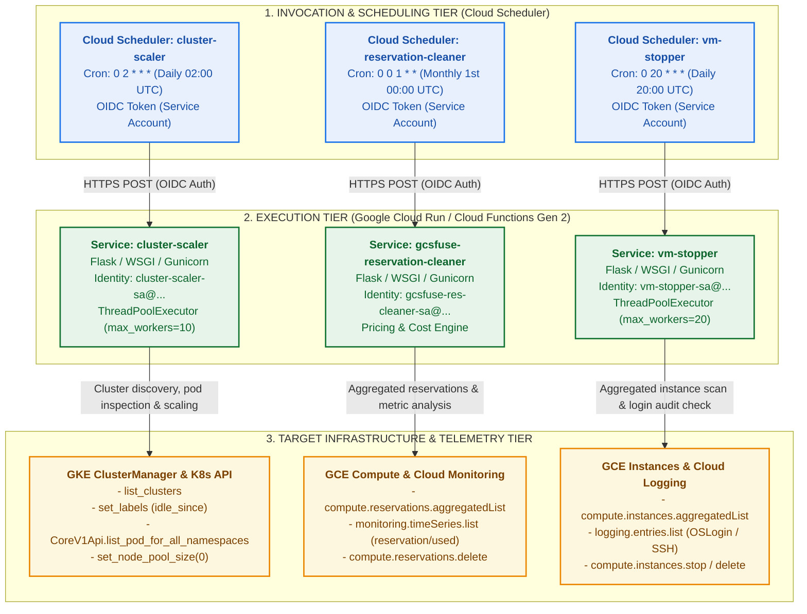
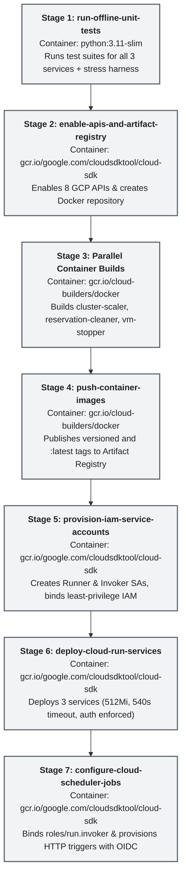

# Google Cloud Infrastructure Automation Suite (`cloud-run-services`)

[](https://www.python.org/)
[](https://cloud.google.com/run)
[](https://cloud.google.com/iam)
[](./cloudbuild.yaml)
[-success.svg)](./verify_deployment_artifacts.py)

A collection of project-agnostic, enterprise-grade cloud automation services packaged for Google Cloud Run and Google Cloud Functions (Gen 2). Designed to eliminate cloud waste, enforce lifecycle governance, calculate cost savings, and remediate idle compute resources safely across Google Kubernetes Engine (GKE) and Google Compute Engine (GCE).

The suite provides a **hybrid 3-tier deployment model**:
1. **Unified CLI Deployer (`deploy_all.sh`)**: Interactive or scripted bash orchestrator supporting multi-service selection, dry-run simulation, and pre-deployment test gating.
2. **Automated Cloud Build CI/CD Pipeline (`cloudbuild.yaml`)**: End-to-end 7-stage automated pipeline with offline unit test gating, parallel container builds, IAM provisioning, and Cloud Scheduler HTTP trigger configuration.
3. **Declarative Terraform Module (`terraform/`)**: Modular Infrastructure-as-Code declaring Cloud Run v2 services, Cloud Scheduler jobs, and least-privilege IAM bindings with service toggles and parameterized schemas.

---

## Table of Contents

1. [Executive Overview & Multi-Tool Architecture](#1-executive-overview--multi-tool-architecture)
2. [Tool Capability & Comparison Matrix](#2-tool-capability--comparison-matrix)
3. [Unified IAM Security & Governance Model](#3-unified-iam-security--governance-model)
4. [Directory Structure & Code Layout](#4-directory-structure--code-layout)
5. [Deployment Approaches & Orchestration Guide](#5-deployment-approaches--orchestration-guide)
   - [5.1 Method 1: Unified Multi-Service CLI Deployer (`deploy_all.sh`)](#51-method-1-unified-multi-service-cli-deployer-deploy_allsh)
   - [5.2 Method 2: Automated Cloud Build CI/CD Pipeline (`cloudbuild.yaml`)](#52-method-2-automated-cloud-build-cicd-pipeline-cloudbuildyaml)
   - [5.3 Method 3: Declarative Terraform Module (`terraform/`)](#53-method-3-declarative-terraform-module-terraform)
6. [Comprehensive Testing & Validation Guide](#6-comprehensive-testing--validation-guide)
   - [6.1 Automated Verification Suite (`verify_deployment_artifacts.py`)](#61-automated-verification-suite-verify_deployment_artifactspy)
   - [6.2 Test Sub-Suite Breakdown & Coverage](#62-test-sub-suite-breakdown--coverage)
   - [6.3 Running Unit & Stress Test Suites](#63-running-unit--stress-test-suites)
   - [6.4 Local Development & WSGI HTTP Testing](#64-local-development--wsgi-http-testing)
7. [Maintenance, Scheduling & Operations Runbook](#7-maintenance-scheduling--operations-runbook)
   - [7.1 Manually Triggering On-Demand Sweeps](#71-manually-triggering-on-demand-sweeps)
   - [7.2 Inspecting Operational Logs](#72-inspecting-operational-logs)
   - [7.3 Pausing and Resuming Automated Schedules](#73-pausing-and-resuming-automated-schedules)
   - [7.4 Incident Handling & Troubleshooting](#74-incident-handling--troubleshooting)
8. [License & Contributions](#8-license--contributions)

---

## 1. Executive Overview & Multi-Tool Architecture

In cloud development, continuous integration, and large-scale AI/ML testing environments, cloud infrastructure is frequently provisioned dynamically and left running long after workloads finish. Over time, abandoned GKE node pools, unattached GCE compute reservations, and idle standalone VMs accumulate significant recurring costs.

The **Cloud Run Automation Suite** provides three independent, specialized automation services:

1. **`cluster-scaler`**: Fleet management for GKE clusters. Inspects running pods across user Kubernetes namespaces (excluding system namespaces), tracks cluster idle lifecycles with resource labels (`idle_since`), and automatically resizes standard node pools to size 0 once idle thresholds are exceeded.
2. **`gcsfuse-reservation-cleaner`**: Audits GCE compute reservations across all zones, verifies real-time and historical utilization via Cloud Monitoring time-series metrics (`compute.googleapis.com/reservation/used`), calculates financial savings against machine-type pricing catalogs, and purges stale/never-used reservations while **strictly protecting active reservations** (`in_use_now > 0`).
3. **`vm-stopper`**: Discovers standalone GCE VM instances across all zones, automatically excludes GKE nodes and Managed Instance Group (MIG) members, queries Cloud Logging OSLogin audit events to detect idle running VMs, and safely stops idle instances (with optional deletion of long-stopped VMs).

### Multi-Tool Architecture Blueprint



### Architectural Principles

1. **Zero Hardcoded Identifiers & Dynamic Configuration**:
   All services are decoupled from specific GCP project IDs, project numbers, or regional endpoints. Target projects, thresholds, and filters are resolved dynamically in order:
   $$\text{JSON Request Body} \longrightarrow \text{URL Query Parameters} \longrightarrow \text{Environment Variables} \longrightarrow \text{ADC Default Project}$$
2. **Dual-Entrypoint Serverless Packaging**:
   Each tool provides a dual entrypoint in `main.py`:
   - Standard Flask WSGI application served by Gunicorn in containerized Google Cloud Run deployments.
   - `@functions_framework.http` decorator compatibility for Google Cloud Functions (Gen 2).
3. **Non-Destructive Dry-Run Simulation**:
   Every service supports `dry_run: true` mode across all invocation channels (payload, query parameters, environment variables). In dry-run mode, full sweeps, metric analyses, and candidate selections are executed and logged without issuing mutating API calls.
4. **Resilient Error Isolation**:
   Evaluations are executed in parallel worker threads inside robust `try...except` boundaries. Transient API timeouts, permission errors, or lock contentions on single resources are captured in `errors[]` arrays and never fail the entire fleet sweep.

---

## 2. Tool Capability & Comparison Matrix

| Capability / Attribute | `cluster-scaler` | `gcsfuse-reservation-cleaner` | `vm-stopper` |
| :--- | :--- | :--- | :--- |
| **Target Infrastructure** | Google Kubernetes Engine (GKE) Clusters & Node Pools | Google Compute Engine (GCE) Reservations | Google Compute Engine (GCE) VM Instances |
| **Primary Remediation Action** | Resizes idle node pools to size 0 (sets autoscaling min to 0) | Deletes stale or abandoned compute reservations | Stops idle running VMs (optional deletion of long-stopped VMs) |
| **Default Schedule** | Daily at 02:00 UTC (`0 2 * * *`) | Monthly on the 1st at 00:00 UTC (`0 0 1 * *`) | Daily at 20:00 UTC (`0 20 * * *`) |
| **Idle Detection Method** | K8s API pod inspection across non-system namespaces | Cloud Monitoring metrics (`compute.googleapis.com/reservation/used`) | Cloud Logging OSLogin audit events and instance metadata events |
| **Idle Threshold Parameter** | `idle_days_threshold` (Default: `7` days) | `delete_idle_days` (Default: `60` days) | `idle_days_threshold` (Default: `7` days) |
| **Lifecycle State Tracking** | Stamped GKE cluster labels: `idle_since=YYYY-MM-DD` | Historical utilization lookback (Default: `730` days) | Instance `creationTimestamp` + Cloud Logging timestamp |
| **System Workload Safety** | Automatically ignores `kube-*`, `gke-*`, CSI drivers, and add-on namespaces | **Strict Guarantee**: Reservations with `in_use_now > 0` are never deleted | Automatically excludes GKE nodes (`gke-`, `gk3-`) and MIG instances (`created-by`) |
| **Autopilot Support** | Detects Autopilot clusters and marks `autopilot-managed` | N/A | N/A |
| **Exclusion / Whitelist Filters** | `exclude_label_keys`, `whitelist_tags`, `cluster_names`, `ignored_namespaces` | `exclude_label_keys`, `whitelist_tags`, `zones`, `reservation_names` | `exclude_label_keys`, `exclude_label_values`, `whitelist_tags`, `whitelist_names` |
| **Visited / Tinkered Protection** | Resets idle countdown & removes `idle_since` if accessed/active today | N/A | Resets idle duration upon interactive SSH/OSLogin |
| **Fail-Safe On Telemetry Error** | Records error in response and skips cluster | Classifies as `Query Error` and retains reservation | Assumes VM is **active** to prevent accidental stops |
| **Dry-Run Simulation** | Supported (`dry_run: true`) | Supported (`dry_run: true`) | Supported (`dry_run: true`) |
| **Concurrency Engine** | `ThreadPoolExecutor(max_workers=10)` | `ThreadPoolExecutor(max_workers=10)` | `ThreadPoolExecutor(max_workers=20)` |

### Protection Tags & Exemption Labels (Opt-Out Safeguards)

You can protect any VM, GKE Cluster, or Compute Reservation from automated stopping, scaling down, or deletion by applying standard tags or labels to the resource:

#### Supported Out-of-the-Box Protection Tags & Labels
| Resource Type | Protection Mechanism | Supported Keys / Values |
| :--- | :--- | :--- |
| **VM Instances** (`vm-stopper`) | **Network Tags** | `keep-alive`, `do-not-stop`, `do-not-delete`, `protected`, `permanent`, `no-auto-stop`, `no-auto-delete`, `skip-lifecycle` |
| | **GCE Labels** | `keep-alive: true`, `do-not-stop: true`, `do-not-delete: true`, `protected: true`, `permanent: true`, `auto-stop: false`, `auto-delete: false` |
| | **Instance Metadata** | `keep-alive=true`, `do-not-stop=true`, `do-not-delete=true`, `protected=true`, `auto-stop=false` |
| **GKE Clusters** (`cluster-scaler`) | **Resource Labels** | `keep-alive: true`, `do-not-scale: true`, `do-not-stop: true`, `protected: true`, `permanent: true`, `no-auto-scale: true`, `auto-scale: false` |
| **Reservations** (`reservation-cleaner`) | **Resource Labels** | `keep-alive: true`, `do-not-delete: true`, `protected: true`, `permanent: true`, `no-auto-delete: true`, `auto-delete: false` |

> [!TIP]
> Custom label keys, values, or network tags can also be passed via the request payload (e.g. `{"exclude_label_keys": ["team-critical"], "whitelist_tags": ["staging-safe"]}`) or environment variables (`EXCLUDE_LABEL_KEYS`, `WHITELIST_TAGS`).

---

## 3. Unified IAM Security & Governance Model

The automation suite implements strict least-privilege separation of duties between the **Runtime Execution Identity** (Runner Service Account) and the **Invocation Identity** (Scheduler Service Account).

```
+-----------------------------------------------------------------------------------------+
|                                     GCP PROJECT                                         |
|                                                                                         |
|  +------------------------+      OIDC Bearer Token       +---------------------------+  |
|  |  Scheduler Service SA  | ---------------------------> |     Runner Service SA     |  |
|  | roles/run.invoker      |     (Audience: Cloud Run)    | (Least Privilege Runtime) |  |
|  +------------------------+                              +-------------+-------------+  |
|                                                                        |                |
|                                           +----------------------------+------------+   |
|                                           |                                         |   |
|                                           v                                         v   |
|                              +-------------------------+               +----------------+
|                              | GKE / GCE Compute APIs  |               | Logging/Metric |
|                              +-------------------------+               +----------------+
+-----------------------------------------------------------------------------------------+
```

### Complete IAM Roles & Permissions Matrix

| Service | Service Account Role | Recommended Email Format | Assigned IAM Role | Purpose & Permissions Justification |
| :--- | :--- | :--- | :--- | :--- |
| **`cluster-scaler`** | Runtime (Runner SA) | `cluster-scaler-sa@${PROJECT_ID}.iam.gserviceaccount.com` | `roles/container.admin` | Required to list clusters, update GKE labels (`idle_since`), and scale node pools. |
| | Runtime (Runner SA) | `cluster-scaler-sa@${PROJECT_ID}.iam.gserviceaccount.com` | `roles/logging.logWriter` | Emits structured JSON logs to Cloud Logging. |
| | In-Cluster RBAC | GKE Control Plane | `ClusterRole` / `ClusterRoleBinding` | Grants Runner SA permission to list pods across namespaces via Kubernetes API. |
| | Invoker (Scheduler SA) | `cluster-scaler-sched@${PROJECT_ID}.iam.gserviceaccount.com` | `roles/run.invoker` | Authorizes Cloud Scheduler to generate OIDC tokens to invoke Cloud Run. |
| **`gcsfuse-reservation-cleaner`** | Runtime (Runner SA) | `gcsfuse-res-cleaner-sa@${PROJECT_ID}.iam.gserviceaccount.com` | `roles/compute.instanceAdmin.v1` | Required to discover aggregated reservations and delete stale reservations. |
| | Runtime (Runner SA) | `gcsfuse-res-cleaner-sa@${PROJECT_ID}.iam.gserviceaccount.com` | `roles/monitoring.viewer` | Required to read utilization metrics from `compute.googleapis.com/reservation/used`. |
| | Runtime (Runner SA) | `gcsfuse-res-cleaner-sa@${PROJECT_ID}.iam.gserviceaccount.com` | `roles/logging.logWriter` | Emits structured JSON logs to Cloud Logging. |
| | Invoker (Scheduler SA) | `gcsfuse-res-cleaner-sched@${PROJECT_ID}.iam.gserviceaccount.com` | `roles/run.invoker` | Authorizes Cloud Scheduler to invoke the Cloud Run endpoint. |
| **`vm-stopper`** | Runtime (Runner SA) | `vm-stopper-sa@${PROJECT_ID}.iam.gserviceaccount.com` | `roles/compute.instanceAdmin.v1` | Required to list instances across zones, execute `instances.stop`, and delete old VMs. |
| | Runtime (Runner SA) | `vm-stopper-sa@${PROJECT_ID}.iam.gserviceaccount.com` | `roles/logging.viewer` | Required to query OSLogin and SSH Cloud Audit logs. |
| | Runtime (Runner SA) | `vm-stopper-sa@${PROJECT_ID}.iam.gserviceaccount.com` | `roles/logging.logWriter` | Emits structured JSON logs to Cloud Logging. |
| | Invoker (Scheduler SA) | `vm-stopper-sched@${PROJECT_ID}.iam.gserviceaccount.com` | `roles/run.invoker` | Authorizes Cloud Scheduler to invoke the Cloud Run endpoint. |

### Cross-Project & Centralized Governance Pattern

Organizations operating multiple GCP projects can deploy the automation suite in a **Central Governance Project** and manage remote target projects without deploying separate Cloud Run containers in each project:

```
[ Central Governance Project: sec-ops-prod ]
   │
   ├── Cloud Scheduler (Daily Trigger with target payload: {"project": "app-dev-123"})
   └── Cloud Run Service (cluster-scaler / vm-stopper / reservation-cleaner)
        │
        ├── Target Project A (app-dev-123): Runner SA granted container.admin / compute.instanceAdmin.v1
        ├── Target Project B (ml-training-456): Runner SA granted compute.instanceAdmin.v1
        └── Target Project C (ci-cd-runner-789): Runner SA granted container.admin
```

To configure cross-project remediation:
```bash
# Grant Runner SA access to target project 'app-dev-123'
gcloud projects add-iam-policy-binding app-dev-123 \
  --member="serviceAccount:cluster-scaler-sa@sec-ops-prod.iam.gserviceaccount.com" \
  --role="roles/container.admin"
```

---

## 4. Directory Structure & Code Layout

```
cloud-run-services/
├── README.md                                  # Unified master documentation and multi-tool guide
├── deploy_all.sh                              # Method 1: Unified CLI deployment orchestrator
├── cloudbuild.yaml                            # Method 2: Automated Cloud Build CI/CD pipeline
├── verify_deployment_artifacts.py             # E2E automated verification test suite (100% offline)
├── verify_stress_tests.py                     # Empirical adversarial stress test harness
│
├── terraform/                                 # Method 3: Declarative Terraform module
│   ├── main.tf                                # Cloud Run v2, Cloud Scheduler, IAM & SA resources
│   ├── variables.tf                           # Variable schemas, types, descriptions, and defaults
│   ├── outputs.tf                             # Service URLs, scheduler job IDs, and composite maps
│   ├── terraform.tfvars.example               # Annotated sample variables file
│   └── README.md                              # Terraform module architecture and usage guide
│
├── cluster-scaler/                            # GKE Idle Cluster & Node Pool Scaler
│   ├── Dockerfile                             # Python 3.11-slim + Gunicorn container definition
│   ├── .dockerignore                          # Build artifact exclusions
│   ├── Procfile                               # Process runner specification
│   ├── README.md                              # 9-section tool-specific guide
│   ├── deploy.sh                              # Standalone deployment & scheduler setup script
│   ├── main.py                                # Dual entrypoints (Flask WSGI & Functions Framework)
│   ├── requirements.txt                       # Production Python dependencies
│   ├── scaler/
│   │   ├── __init__.py                        # Scaler package exports
│   │   ├── cluster_processor.py               # Pod inspection, idle tracking, node pool scaling
│   │   ├── config.py                          # Hierarchical config resolution & validation
│   │   ├── gke_client.py                      # GKE API wrapper & dynamic K8s bearer auth
│   │   └── service.py                         # Multi-threaded fleet orchestration service
│   └── tests/
│       ├── __init__.py                        # Test package marker
│       └── test_cluster_scaler.py             # 100% offline mock unit tests (36 tests)
│
├── gcsfuse-reservation-cleaner/               # GCE Compute Reservation Cleaner
│   ├── Dockerfile                             # Python 3.11-slim + Gunicorn container definition
│   ├── Procfile                               # Process runner specification
│   ├── README.md                              # 9-section tool-specific guide
│   ├── deploy.sh                              # Standalone deployment & scheduler setup script
│   ├── main.py                                # Dual entrypoints (Flask WSGI & Functions Framework)
│   ├── requirements.txt                       # Production Python dependencies
│   ├── cleaner/
│   │   ├── __init__.py                        # Cleaner package exports
│   │   ├── config.py                          # Hierarchical config resolution & validation
│   │   ├── pricing.py                         # GCE machine type and GPU pricing catalog
│   │   ├── reservation_client.py              # Compute reservation & Monitoring metrics client
│   │   ├── reservation_processor.py           # Stale evaluation and deletion safety logic
│   │   └── service.py                         # Concurrent sweep coordinator and reporting
│   └── tests/
│       ├── __init__.py                        # Test package marker
│       └── test_reservation_cleaner.py        # 100% offline mock unit tests (43 tests)
│
└── vm-stopper/                                # GCE Idle VM Remediation Service
    ├── Dockerfile                             # Python 3.11-slim + Gunicorn container definition
    ├── Procfile                               # Process runner specification
    ├── README.md                              # 9-section tool-specific guide
    ├── deploy.sh                              # Standalone deployment & scheduler setup script
    ├── main.py                                # Dual entrypoints (Flask WSGI & Functions Framework)
    ├── requirements.txt                       # Production Python dependencies
    ├── stopper/
    │   ├── __init__.py                        # Stopper package exports
    │   ├── config.py                          # Hierarchical config resolution & validation
    │   ├── gce_client.py                      # Compute instances & Cloud Logging client wrapper
    │   ├── service.py                         # Request orchestration and HTTP response handling
    │   └── vm_processor.py                    # GKE/MIG filtering, idle detection, VM stopping
    └── tests/
        ├── __init__.py                        # Test package marker
        └── test_vm_stopper.py                 # 100% offline mock unit tests (43 tests)
```

---

## 5. Deployment Approaches & Orchestration Guide

The suite supports three distinct deployment workflows tailored to different operational requirements:

```
┌─────────────────────────────────────────────────────────────────────────────────────────────────┐
│                                 CHOOSE YOUR DEPLOYMENT METHOD                                   │
├─────────────────────────────┬─────────────────────────────────┬─────────────────────────────────┤
│   Method 1: CLI Deployer    │   Method 2: Cloud Build CI/CD   │   Method 3: Terraform Module    │
│      (deploy_all.sh)        │        (cloudbuild.yaml)        │          (terraform/)           │
├─────────────────────────────┼─────────────────────────────────┼─────────────────────────────────┤
│ • Interactive CLI & scripts │ • Automated Git/webhook triggers│ • GitOps & declarative IaC      │
│ • Service selection flag    │ • 7-stage containerized pipeline│ • Multi-workspace state mgmt    │
│ • Built-in dry-run preview  │ • Pre-deployment test gating    │ • Fine-grained module toggles   │
│ • Quickest setup for admins │ • Standardized enterprise CI/CD │ • Enterprise audit compliance   │
└─────────────────────────────┴─────────────────────────────────┴─────────────────────────────────┘
```

---

### 5.1 Method 1: Unified Multi-Service CLI Deployer (`deploy_all.sh`)

`cloud-run-services/deploy_all.sh` is an interactive and scripted deployment orchestrator that builds container images, creates Service Accounts, assigns IAM bindings, deploys Cloud Run services, and configures Cloud Scheduler HTTP triggers across selected services in a single command.

#### Execution Lifecycle Stages
```
[Stage 1: Offline Unit Test Gating] ──▶ [Stage 2: API Enablement] ──▶ [Stage 3: Artifact Registry Setup]
                                                                                   │
[Stage 5: Formatted Summary] ◀── [Stage 4: Per-Service Provisioning & Scheduling] ◀─┘
                                   ├── 1. Service Account & Least-Privilege IAM Bindings
                                   ├── 2. Cloud Build Container Image Build & Push
                                   ├── 3. Cloud Run Service Deployment (512Mi, 540s)
                                   ├── 4. Grant roles/run.invoker to Scheduler SA
                                   └── 5. Cloud Scheduler Job Create/Update with OIDC
```

#### CLI Flags and Syntax Reference

| Flag | Long Flag | Env Variable | Default Value | Description |
| :--- | :--- | :--- | :--- | :--- |
| `-p` | `--project` | `PROJECT_ID` | Active `gcloud` config | Target Google Cloud Project ID |
| `-r` | `--region` | `REGION` | `us-central1` | GCP Region for Cloud Run & Cloud Scheduler |
| `-s` | `--services` | `SERVICES` | `all` | Services to deploy: `all`, `cluster-scaler`, `gcsfuse-reservation-cleaner`, `vm-stopper` (comma/space-separated) |
| `-a` | `--service-account`| `RUNNER_SA_EMAIL` | Auto-created | Custom runtime Service Account email override |
| | `--scheduler-sa` | `SCHEDULER_SA_EMAIL` | Auto-created | Custom Cloud Scheduler Invoker Service Account email override |
| `-d` | `--dry-run` | `DRY_RUN` | `false` | Preview planned commands and set `"dry_run": true` in scheduler payloads |
| | `--skip-tests` | `SKIP_TESTS` | `false` | Bypass Stage 1 pre-deployment offline unit test gating |
| | `--repo-name` | `REPO_NAME` | `gcsfuse-tools` | Artifact Registry Docker repository name |
| | `--cluster-scaler-schedule` | `CLUSTER_SCALER_SCHEDULE` | `"0 2 * * *"` | Cron schedule for `cluster-scaler` (Daily at 02:00 UTC) |
| | `--cleaner-schedule` | `CLEANER_SCHEDULE` | `"0 0 1 * *"` | Cron schedule for `gcsfuse-reservation-cleaner` (Monthly 1st 00:00 UTC) |
| | `--vm-stopper-schedule` | `VM_STOPPER_SCHEDULE` | `"0 20 * * *"` | Cron schedule for `vm-stopper` (Daily at 20:00 UTC) |
| `-t` | `--threshold` | `IDLE_DAYS_THRESHOLD` | `7` | Days of inactivity before resizing idle GKE node pools to 0 |
| `-h` | `--help` | - | - | Displays usage instructions and exits with code 0 |

#### Service Selection (`--services`)
The `--services` flag supports flexible combinations and aliases:
```bash
# Deploy all three services:
./deploy_all.sh --project my-project --services all

# Deploy a specific single service:
./deploy_all.sh --project my-project --services cluster-scaler

# Deploy multiple selected services using a comma-separated list:
./deploy_all.sh --project my-project --services "vm-stopper,gcsfuse-reservation-cleaner"

# Service name aliases supported:
# - cleaner | reservation-cleaner -> gcsfuse-reservation-cleaner
# - stopper -> vm-stopper
```

#### Dry-Run Simulation Mode (`--dry-run`)
When `-d` or `--dry-run` is specified:
- No mutating GCP API calls are made.
- Planned gcloud CLI commands are printed with a `[DRY-RUN]` prefix.
- The Cloud Scheduler payload is configured with `{"dry_run": true}`, ensuring scheduled runs only evaluate and log actions without modifying infrastructure.

#### CLI Invocations Examples
```bash
# Example 1: Full deployment to a specific project with pre-deployment test gating
cd cloud-run-services
./deploy_all.sh --project my-gcp-project --region us-central1

# Example 2: Dry-run preview of VM Stopper with custom schedule
./deploy_all.sh -p my-gcp-project -s vm-stopper --vm-stopper-schedule "0 22 * * *" --dry-run

# Example 3: Standalone deployment of an individual service via its own deploy.sh
cd cloud-run-services/cluster-scaler
./deploy.sh --project my-gcp-project --region us-central1 --schedule "0 3 * * *"
```

---

### 5.2 Method 2: Automated Cloud Build CI/CD Pipeline (`cloudbuild.yaml`)

`cloud-run-services/cloudbuild.yaml` provides a fully automated, cloud-native CI/CD pipeline triggered manually or automatically on Git commits.

#### 7-Stage Pipeline Lifecycle



#### Offline Unit Test Gating
Before compiling container images or mutating GCP resources, Stage 1 executes all unit test suites (`cluster-scaler/tests`, `gcsfuse-reservation-cleaner/tests`, `vm-stopper/tests`) and the adversarial stress harness (`verify_stress_tests.py`). Any test failure immediately terminates the build with a non-zero exit code.

#### Substitution Variables Reference Table

| Variable | Default Value | Description |
| :--- | :--- | :--- |
| `_PROJECT_ID` | `""` | Target Google Cloud Project ID where services and schedulers are provisioned. |
| `_REGION` | `"us-central1"` | GCP Region for Artifact Registry, Cloud Run, and Cloud Scheduler. |
| `_REPO_NAME` | `"gcsfuse-tools"` | Artifact Registry Docker repository name. |
| `_IMAGE_TAG` | `"latest"` | Tag applied to compiled container images. |
| `_DRY_RUN` | `"false"` | Global dry-run flag passed to Cloud Run environment and scheduler payloads. |
| `_CLUSTER_SCALER_SCHEDULE` | `"0 2 * * *"` | Cron expression for `cluster-scaler` (Daily at 02:00 UTC). |
| `_CLEANER_SCHEDULE` | `"0 0 1 * *"` | Cron expression for `gcsfuse-reservation-cleaner` (Monthly 1st 00:00 UTC). |
| `_VM_STOPPER_SCHEDULE` | `"0 20 * * *"` | Cron expression for `vm-stopper` (Daily at 20:00 UTC). |
| `_IDLE_DAYS_THRESHOLD` | `"7"` | Inactivity threshold in days before scaling idle GKE node pools. |
| `_CLUSTER_SCALER_SA` | `"cluster-scaler-sa"` | Name of the Runtime Service Account for `cluster-scaler`. |
| `_CLUSTER_SCALER_SCHEDULER_SA`| `"cluster-scaler-sched"` | Name of the Invoker Service Account for `cluster-scaler-scheduler`. |
| `_CLEANER_SA` | `"gcsfuse-res-cleaner-sa"` | Name of the Runtime Service Account for `reservation-cleaner`. |
| `_CLEANER_SCHEDULER_SA` | `"gcsfuse-res-cleaner-sched"` | Name of the Invoker Service Account for `reservation-cleaner-scheduler`. |
| `_VM_STOPPER_SA` | `"vm-stopper-sa"` | Name of the Runtime Service Account for `vm-stopper`. |
| `_VM_STOPPER_SCHEDULER_SA` | `"vm-stopper-sched"` | Name of the Invoker Service Account for `vm-stopper-scheduler`. |

#### Triggering the Pipeline

##### 1. Manual Submission via gcloud CLI
```bash
gcloud builds submit \
  --config=cloud-run-services/cloudbuild.yaml \
  --substitutions=_PROJECT_ID="my-gcp-project",_REGION="us-central1",_DRY_RUN="false" \
  --project="my-gcp-project"
```

##### 2. Automated Git Trigger Setup
Create an automated Cloud Build trigger connected to your GitHub or Cloud Source Repositories repository:
```bash
gcloud builds triggers create github \
  --name="deploy-gcsfuse-automation-suite" \
  --repo-name="gcsfuse-tools" \
  --repo-owner="GoogleCloudPlatform" \
  --branch-pattern="^main$" \
  --build-config="cloud-run-services/cloudbuild.yaml" \
  --substitutions=_PROJECT_ID="my-gcp-project",_REGION="us-central1" \
  --project="my-gcp-project"
```

---

### 5.3 Method 3: Declarative Terraform Module (`terraform/`)

The declarative Terraform module located in `cloud-run-services/terraform/` provides full Infrastructure-as-Code management of Cloud Run v2 services, Cloud Scheduler jobs, and least-privilege IAM bindings.

#### Module Architecture & Resources Managed
- **`google_cloud_run_v2_service`**: Fully managed container services with custom timeouts (`540s`), memory limits (`512Mi`), and authentication enforcement.
- **`google_cloud_scheduler_job`**: HTTP POST triggers with OIDC token generation (`roles/run.invoker`) and JSON payloads.
- **`google_service_account` & `google_project_iam_member`**: Automated provisioning of dedicated runner and invoker service accounts.
- **Service Toggles**: Fine-grained boolean flags (`enable_cluster_scaler`, `enable_reservation_cleaner`, `enable_vm_stopper`) allowing selective enablement.

#### Quickstart Guide

```bash
cd cloud-run-services/terraform

# 1. Copy sample variables
cp terraform.tfvars.example terraform.tfvars

# 2. Configure variables
# Edit terraform.tfvars and set project_id = "my-gcp-project"

# 3. Initialize provider and validate syntax
terraform init
terraform validate

# 4. Plan and apply infrastructure
terraform plan -out=tfplan
terraform apply tfplan
```

#### Example `terraform.tfvars` Configuration
```hcl
project_id = "my-gcp-project"
region     = "us-central1"
dry_run    = false

# Selective enablement
enable_cluster_scaler      = true
enable_reservation_cleaner = true
enable_vm_stopper          = true

# Custom schedules
cluster_scaler_schedule      = "0 2 * * *"
reservation_cleaner_schedule = "0 0 1 * *"
vm_stopper_schedule          = "0 20 * * *"
```

> **For complete variable reference, output maps, and enterprise multi-project recipes, see [`cloud-run-services/terraform/README.md`](terraform/README.md).**

---

## 6. Comprehensive Testing & Validation Guide

The automation suite includes a **100% offline executable test framework** that verifies bash scripts, Cloud Build configurations, Terraform modules, service logic, and stress scenarios without requiring live GCP credentials or network access.

### 6.1 Automated Verification Suite (`verify_deployment_artifacts.py`)

Run the complete multi-layer verification suite:
```bash
python3 cloud-run-services/verify_deployment_artifacts.py
```
*Or via standard unittest discovery:*
```bash
python3 -m unittest discover -s cloud-run-services -p "verify_deployment_artifacts.py"
```

#### Test Execution Summary
```
==========================================================================================
GCSFUSE CLOUD RUN SERVICES - DEPLOYMENT ARTIFACTS VERIFICATION SUITE
==========================================================================================
Test Suite / Category                 Total   Passed   Failed   Errors   Skipped   Duration
------------------------------------------------------------------------------------------
TestShellScripts ✓                       10       10        0        0         0      0.67s
TestCloudBuildConfig ✓                    8        8        0        0         0      0.00s
TestTerraformModule ✓                     8        8        0        0         0      0.02s
TestServiceUnitSuites ✓                   4        4        0        0         0      4.80s
------------------------------------------------------------------------------------------
TOTAL                                    30       30        0        0         0      5.50s
==========================================================================================
OVERALL STATUS: ALL 30 VERIFICATION TESTS PASSED CLEANLY [PASS]
==========================================================================================
```

---

### 6.2 Test Sub-Suite Breakdown & Coverage

#### 1. `TestShellScripts` (10 Tests)
Validates all bash scripts across the repository (`deploy_all.sh`, `cluster-scaler/deploy.sh`, `gcsfuse-reservation-cleaner/deploy.sh`, `vm-stopper/deploy.sh`):
- `test_bash_syntax_on_all_deploy_scripts`: Validates `bash -n` static syntax across all 4 scripts.
- `test_help_flags_exit_code_and_usage`: Asserts `--help` and `-h` return exit code 0 and emit usage text.
- `test_deploy_all_help_contents`: Confirms `deploy_all.sh --help` documents all options, variables, and service targets.
- `test_unknown_and_invalid_flags_rejected`: Asserts unrecognized flags trigger non-zero exit code.
- `test_missing_argument_values_rejected`: Verifies missing arguments to flags fail safely.
- `test_services_argument_validation`: Validates whitelist parsing (`all`, `cluster-scaler`, `gcsfuse-reservation-cleaner`, `vm-stopper`, comma/space separated) and rejects invalid service names.
- `test_missing_project_handling`: Validates that omitting project ID when unconfigured in gcloud results in exit code 1 with descriptive remediation guidance.
- `test_dry_run_simulation_mode`: Verifies `--dry-run` executes preview planning without issuing mutating API calls and sets `"dry_run": true` in payloads.
- `test_schedule_and_threshold_customizations`: Validates custom cron expressions and idle thresholds propagate cleanly.
- `test_iam_permission_flags_and_dry_run_checks`: Validates IAM automation flags (-y, --yes, --auto-grant-roles, --no-grant-roles) parse cleanly in dry-run mode.

#### 2. `TestCloudBuildConfig` (8 Tests)
Validates `cloud-run-services/cloudbuild.yaml` syntax, step ordering, and parameterization:
- `test_cloudbuild_yaml_syntax_and_root_keys`: Validates YAML parsing and required root keys (`steps`, `substitutions`, `images`, `options`, `timeout`).
- `test_pre_deployment_unit_test_gating_step`: Asserts Stage 1 executes offline unit tests across all 3 services before any build step.
- `test_parallel_image_build_steps`: Verifies Docker build steps exist for all 3 services.
- `test_image_push_or_artifact_registry_images`: Verifies `images` block registers all container image targets.
- `test_cloud_run_deploy_steps`: Validates Cloud Run deployment steps enforce authentication (`--no-allow-unauthenticated`), timeout `540s`, and memory `512Mi`.
- `test_scheduler_configuration_steps`: Validates Cloud Scheduler HTTP POST jobs configure OIDC bearer token authentication.
- `test_substitutions_schema_and_defaults`: Verifies complete substitutions dictionary and default values.
- `test_cloudbuild_options_and_timeout`: Validates pipeline timeout (>= 600s) and logging policy (`CLOUD_LOGGING_ONLY`).

#### 3. `TestTerraformModule` (8 Tests)
Validates the declarative Terraform module under `cloud-run-services/terraform/`:
- `test_required_terraform_files_exist`: Verifies `main.tf`, `variables.tf`, `outputs.tf`, `terraform.tfvars.example`, and `README.md` exist.
- `test_hcl_delimiter_balance_across_all_tf_files`: Performs offline HCL static analysis verifying balanced braces, brackets, and parentheses.
- `test_all_variables_have_types_and_descriptions`: Ensures every variable in `variables.tf` has an explicit `type` and meaningful `description`.
- `test_core_variables_declared_with_correct_types`: Asserts required `project_id`, service toggles (`enable_*`), schedules, and dry-run variables are typed.
- `test_required_resources_declared_in_main_tf`: Validates declarations of `google_cloud_run_v2_service`, `google_cloud_scheduler_job`, `google_service_account`, `google_project_iam_member`, and `google_cloud_run_v2_service_iam_member`.
- `test_required_outputs_defined`: Verifies individual service URLs, scheduler job names, and composite lookup maps (`service_urls`, `scheduler_jobs`, `runner_service_accounts`, `scheduler_service_accounts`).
- `test_tfvars_example_matches_variables_tf`: Verifies all keys in `terraform.tfvars.example` correspond to valid declarations in `variables.tf`.
- `test_terraform_cli_if_available`: Runs `terraform fmt -check` when the CLI binary is available.

#### 4. `TestServiceUnitSuites` (4 Tests)
Programmatically executes and validates sub-service test suites and empirical stress harnesses:
- `test_cluster_scaler_unit_tests`: 36 unit tests passed (100% offline).
- `test_reservation_cleaner_unit_tests`: 36 unit tests passed (100% offline).
- `test_vm_stopper_unit_tests`: 39 unit tests passed (100% offline).
- `test_adversarial_stress_tests`: 11 complex adversarial stress scenarios passed (100% offline).

---

### 6.3 Running Unit & Stress Test Suites

#### Option A: Running Service Unit Tests via `pytest`
```bash
(cd cloud-run-services/cluster-scaler && pytest tests/ -v)
(cd cloud-run-services/gcsfuse-reservation-cleaner && pytest tests/ -v)
(cd cloud-run-services/vm-stopper && pytest tests/ -v)
```

#### Option B: Running Service Unit Tests via standard `unittest`
```bash
(cd cloud-run-services/cluster-scaler && python3 -m unittest discover -s tests -v)
(cd cloud-run-services/gcsfuse-reservation-cleaner && python3 -m unittest discover -s tests -v)
(cd cloud-run-services/vm-stopper && python3 -m unittest discover -s tests -v)
```

#### Option C: Running the Adversarial Stress Test Harness
```bash
cd cloud-run-services
PYTHONPATH="cluster-scaler:gcsfuse-reservation-cleaner:vm-stopper:." python3 verify_stress_tests.py
```

---

### 6.4 Local Development & WSGI HTTP Testing

To test any service locally using the built-in Flask WSGI server:

```bash
cd cloud-run-services/vm-stopper
export PROJECT_ID="local-test-project"
export DRY_RUN="true"
export PORT="8080"
python3 main.py
```

In a separate terminal, trigger a simulated run:
```bash
curl -X POST http://localhost:8080/ \
  -H "Content-Type: application/json" \
  -d '{
    "project": "local-test-project",
    "idle_days_threshold": 7,
    "dry_run": true
  }'
```

---

## 7. Maintenance, Scheduling & Operations Runbook

### 7.1 Manually Triggering On-Demand Sweeps

#### Triggering via Cloud Scheduler
```bash
# Manually trigger GKE Cluster Scaler sweep
gcloud scheduler jobs run cluster-scaler-scheduler \
  --project <PROJECT_ID> \
  --location <REGION>

# Manually trigger Reservation Cleaner sweep
gcloud scheduler jobs run gcsfuse-reservation-cleaner-scheduler \
  --project <PROJECT_ID> \
  --location <REGION>

# Manually trigger VM Stopper sweep
gcloud scheduler jobs run vm-stopper-scheduler \
  --project <PROJECT_ID> \
  --location <REGION>
```

#### Direct Invocation via Cloud Run Proxy
```bash
# Trigger immediate dry-run audit on GCE Reservations
gcloud run services proxy gcsfuse-reservation-cleaner \
  --project <PROJECT_ID> \
  --region <REGION> \
  -- http://localhost:8080/ \
  -H "Content-Type: application/json" \
  -d '{"project": "<PROJECT_ID>", "dry_run": true}'
```

### 7.2 Inspecting Operational Logs

Monitor real-time execution logs from Cloud Run:

```bash
# Tail structured logs for VM Stopper
gcloud logging read \
  'resource.type="cloud_run_revision" AND resource.labels.service_name="vm-stopper"' \
  --project <PROJECT_ID> \
  --limit 50 \
  --format="table(timestamp, textPayload, jsonPayload.message)"

# Check Cloud Scheduler invocation history
gcloud logging read \
  'resource.type="cloud_scheduler_job" AND resource.labels.job_id="cluster-scaler-scheduler"' \
  --project <PROJECT_ID> \
  --limit 20
```

### 7.3 Pausing and Resuming Automated Schedules

```bash
# Pause automated scheduler job (e.g. during maintenance or migration windows):
gcloud scheduler jobs pause vm-stopper-scheduler --project <PROJECT_ID> --location <REGION>

# Resume automated scheduler job:
gcloud scheduler jobs resume vm-stopper-scheduler --project <PROJECT_ID> --location <REGION>
```

### 7.4 Incident Handling & Troubleshooting

| Symptom / Error | Root Cause | Remediation Procedure |
| :--- | :--- | :--- |
| `HTTP 403 Forbidden` / `PermissionDenied` | Runner SA lacks required IAM role in target project. | Verify IAM bindings: grant `roles/container.admin` for `cluster-scaler`, `roles/compute.instanceAdmin.v1` and `roles/monitoring.viewer` for `reservation-cleaner`, or `roles/compute.instanceAdmin.v1` and `roles/logging.viewer` for `vm-stopper`. |
| `HTTP 401 Unauthorized` on Scheduler Trigger | Scheduler SA lacks `roles/run.invoker` or OIDC token audience mismatch. | Confirm Cloud Scheduler job has `--oidc-service-account-email` configured and granted `roles/run.invoker` on the Cloud Run service. |
| Node pool resized back to original size immediately | GKE Cluster Autoscaler is enabled and recreated nodes. | `cluster-scaler` automatically adjusts `min_node_count=0` before resizing. If managed by external GitOps (e.g. Terraform/Config Sync), ensure GitOps reconciler does not override min node size. |
| Active VM accidentally stopped | Cloud Logging permission failure or missing whitelist label. | Apply `keep-alive: true` label or add network tag `keep-alive` to exempt instance permanently. Check Cloud Logging viewer permissions on Runner SA. |
| Reservation deletion error | Reservation is attached to active VM or committed use. | `reservation-cleaner` enforces `in_use_now == 0`. If a reservation is newly attached during sweep, GCE API rejects deletion safely. |

---

## 8. License & Contributions

Licensed under the Apache License, Version 2.0. See repository root `LICENSE` for details.
