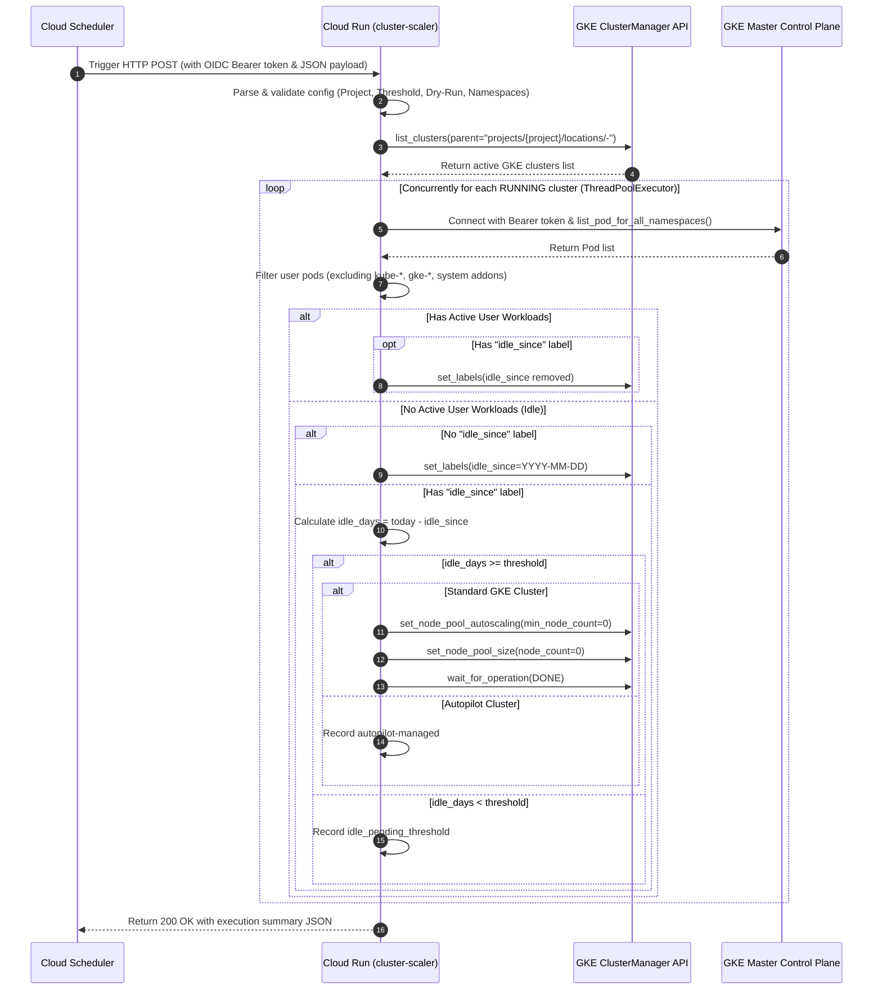

# GKE Cluster Scaler (`cluster-scaler`)

## 1. Title & Architecture Overview

The **GKE Cluster Scaler** is an automated GKE fleet management and cost-optimization service designed for continuous or periodic execution on Google Cloud Run and Google Cloud Functions (Gen 2).

In cloud development, CI/CD, and testing environments, GKE clusters frequently remain provisioned with idle compute nodes long after workloads have completed, incurring significant unnecessary infrastructure costs. The GKE Cluster Scaler solves this by periodically discovering GKE clusters across a project, dynamically inspecting running pods across all non-system Kubernetes namespaces, tracking cluster idle lifecycles using GKE resource labels (`idle_since`), and safely scaling down standard node pools to size 0 once an idle threshold (default: 7 days) is exceeded.

```
+--------------------------+       HTTP POST (OIDC Auth)       +------------------------------------+
|  Cloud Scheduler Trigger |  ------------------------------>  |     Cloud Run Service Container    |
|   (Cron: 0 2 * * *)      |                                   |  (WSGI / Gunicorn / Flask / GCF)   |
+--------------------------+                                   +-----------------+------------------+
                                                                                 |
                                                  +------------------------------+------------------------------+
                                                  |                                                             |
                                                  v                                                             v
                                  +-------------------------------+                             +-------------------------------+
                                  | GKE API (Cluster Discovery)   |                             | Dynamic Kubernetes Control    |
                                  | - list_clusters()             |                             | - Base64 CA cert extraction   |
                                  | - set_labels(idle_since)      |                             | - Bearer token authentication |
                                  | - set_node_pool_size(0)       |                             | - CoreV1Api pod inspection    |
                                  +-------------------------------+                             +-------------------------------+
```

---

## 2. Invocation & Execution Architecture

### 2.1 Invocation Flow



### 2.2 Idle Lifecycle State Machine

```
               [ Discovered GKE Cluster ]
                           |
                 [ Is Status RUNNING? ]
                           |
             +-------------+-------------+
             | No                        | Yes
      [ Skip Cluster ]          [ Query K8s Pods ]
                                         |
                       [ Active User Pods Present? ]
                                         |
                 +-----------------------+-----------------------+
                 | Yes                                           | No
        [ Has "idle_since"? ]                           [ Has "idle_since"? ]
                 |                                               |
         +-------+-------+                               +-------+-------+
         | Yes           | No                            | No            | Yes
   [ Remove Label ] [ Keep Active ]             [ Stamp idle_since ] [ Calculate idle_days ]
         |               |                               |               |
  (active_clusters) (active_clusters)           (idle_marked)    [ idle_days >= threshold? ]
                                                                         |
                                                         +---------------+---------------+
                                                         | No                            | Yes
                                                  (idle_pending)                  [ Scale Pools to 0 ]
                                                                                         |
                                                                                (scaled_down_clusters)
```

---

## 3. Directory Structure & Source of Truth

```
cloud-run-services/cluster-scaler/
├── Dockerfile                         # Production container image (python:3.11-slim + gunicorn)
├── .dockerignore                      # Docker compilation exclusions
├── Procfile                           # Cloud Run process configuration
├── README.md                          # Comprehensive 9-section documentation
├── deploy.sh                          # Parameterized deployment & scheduler provisioning script
├── main.py                            # Dual WSGI & Functions Framework HTTP entrypoints
├── requirements.txt                   # Production dependencies
├── scaler/
│   ├── __init__.py                    # Scaler package definitions & exports
│   ├── cluster_processor.py           # Workload inspection, idle state lifecycle, scaling logic
│   ├── config.py                      # Dynamic configuration resolution & validation
│   ├── gke_client.py                  # GKE ClusterManager and Kubernetes API client wrapper
│   └── service.py                     # Multi-threaded fleet orchestration service
└── tests/
    ├── __init__.py                    # Test package marker
    └── test_cluster_scaler.py         # 100% offline mock test suite
```

---

## 4. Key Capabilities & Safety Controls

1. **Project-Agnostic & Dynamic Configuration**:
   - Zero hardcoded GCP project IDs, project numbers, or regional endpoints.
   - Dynamic resolution order: JSON Request Body -> URL Query Parameters -> Environment Variables -> Application Default Credentials (ADC).
2. **Dry-Run Simulation Mode**:
   - Setting `dry_run: true` evaluates the entire fleet, inspects pods, computes idle durations, and logs planned actions without making any mutating API calls (`set_labels`, `set_node_pool_size`, `set_node_pool_autoscaling`).
3. **Comprehensive System Namespace Protection**:
   - System and managed namespaces are automatically excluded from workload evaluation:
     - Exact match: `kube-system`, `gke-managed-system`, `gke-managed-cim`, `gke-gmp-system`.
     - Prefix match: `kube-*`, `gke-*`.
     - Add-on namespaces: `gcs-fuse-csi-driver`, `gmp-system`, `jobset-system`, `kueue-system`, `istio-system`, `gatekeeper-system`, `config-management-system`, `asm-system`.
   - Supports additional custom ignored namespaces via configuration.
4. **Visited & Tinkered-With Cluster Protection (Idle Countdown Reset)**:
   - If a cluster is visited, modified, or runs jobs on any given day, its idle countdown is immediately reset:
     - **Active Workloads**: Running or pending user pods in non-system namespaces.
     - **Recent Workloads**: Pods created, started, or completed within the activity lookback window (`activity_lookback_hours`, default: 24h).
     - **Recent Node Additions**: Nodes created or scaled up within the lookback window.
     - **GKE Operations**: Operations such as `CREATE_NODE_POOL`, `RESIZE_NODE_POOL`, or `UPDATE_CLUSTER` executed within the lookback window.
     - **Cloud Audit Logs**: User access (`kubectl`, `gcloud container clusters get-credentials`, API updates) detected within the lookback window (excluding automated `cluster-scaler-sa`).
   - If activity is detected on a cluster with an existing `idle_since` label, the `idle_since` label is removed. The cluster will only be scaled down after `idle_days_threshold` (e.g. 7) consecutive idle days following its next period of inactivity.
5. **Autopilot Awareness**:
   - GKE Autopilot clusters dynamically manage node provisioning. When idle threshold is exceeded on an Autopilot cluster, the scaler identifies it and marks it as `autopilot-managed` without attempting incompatible standard node pool resize operations.
6. **Idempotent Node Pool Scaling**:
   - Before scaling a node pool to 0, if autoscaling is enabled, `min_node_count` (and `total_min_node_count` where supported) is updated to `0` to prevent the autoscaler from immediately recreating nodes.
   - If a node pool is already sized at 0 nodes, redundant resize API calls are skipped.
7. **Per-Cluster Error Isolation & Fault Tolerance**:
   - Each cluster is processed in an independent worker thread inside `try...except` error boundaries. If an individual cluster control plane is unreachable or times out, the error is recorded in `results.errors` while remaining clusters across the project continue processing without interruption.

---

## 5. IAM Security Model & Permissions Matrix

The service follows the principle of least privilege using two dedicated Service Accounts:

| Service Account | Assigned Identity | IAM Role | Justification |
|---|---|---|---|
| **Runtime Service Account** | `cluster-scaler-sa@<PROJECT_ID>.iam.gserviceaccount.com` | `roles/container.admin` | Allows listing clusters, updating resource labels (`idle_since`), and scaling node pools to 0. |
| **Runtime Service Account** | `cluster-scaler-sa@<PROJECT_ID>.iam.gserviceaccount.com` | `roles/logging.logWriter` | Emits structured operational logs to Google Cloud Logging. |
| **Scheduler Service Account** | `cluster-scaler-sched@<PROJECT_ID>.iam.gserviceaccount.com` | `roles/run.invoker` | Authorizes Cloud Scheduler to generate OIDC tokens and invoke the protected Cloud Run service. |
| **GKE In-Cluster RBAC** | GKE Control Plane | `ClusterRole` / `ClusterRoleBinding` | Grants runtime SA permission to list pods across namespaces via Kubernetes API. |

---

## 6. Configuration Reference

The service accepts configuration through multiple tiers:

| Parameter | JSON Payload Field | Query Parameter | Env Variable | Default | Description |
|---|---|---|---|---|---|
| Target Project | `project` / `project_id` | `project` / `project_id` | `PROJECT_ID` / `GCP_PROJECT` | ADC Fallback | Target GCP Project ID to sweep. |
| Location | `location` / `region` | `location` / `region` | `LOCATION` / `REGION` | `"-"` (all locations) | GKE location (e.g. `us-central1` or `-`). |
| Idle Days Threshold | `idle_days_threshold` / `days_threshold` | `idle_days_threshold` | `IDLE_DAYS_THRESHOLD` | `7` | Days a cluster must remain continuously idle before scaling to 0. |
| Activity Lookback | `activity_lookback_hours` / `lookback_hours` | `activity_lookback_hours` | `ACTIVITY_LOOKBACK_HOURS` | `24.0` | Hours to check for recent pod activity, GKE operations, and audit logs. |
| Check Audit Logs | `check_audit_logs` | `check_audit_logs` | `CHECK_AUDIT_LOGS` | `true` | Whether to inspect Cloud Audit logs for user/kubectl interactions. |
| Dry Run Mode | `dry_run` | `dry_run` | `DRY_RUN` | `false` | When true, skips all mutating GKE API calls. |
| Concurrency Workers | `max_workers` | `max_workers` | `MAX_WORKERS` | `10` | Maximum parallel threads for cluster evaluation. |
| Ignored Namespaces | `ignored_namespaces` | `ignored_namespaces` | `IGNORED_NAMESPACES` | System list | Custom comma-separated or list of system namespaces. |
| Target Clusters | `cluster_names` / `clusters` | `cluster_names` | `CLUSTER_NAMES` | `None` (all clusters) | Optional whitelist of specific cluster names to evaluate. |
| Exclude Label Keys | `exclude_label_keys` | `exclude_label_keys` | `EXCLUDE_LABEL_KEYS` | `["keep-alive", "do-not-scale", "do-not-stop", "protected", "permanent", "no-auto-scale", "no-auto-stop", "skip-lifecycle"]` | Cluster resource label keys that exempt cluster from scaling. |
| Whitelist Tags / Labels | `whitelist_tags` | `whitelist_tags` | `WHITELIST_TAGS` | `["keep-alive", "do-not-scale", "do-not-stop", "protected", "permanent", "no-auto-scale", "no-auto-stop", "skip-lifecycle"]` | Tag/label names that exempt cluster from scaling. |

### Sample HTTP Request Payload

```json
{
  "project": "my-target-gcp-project",
  "location": "-",
  "idle_days_threshold": 7,
  "dry_run": false,
  "max_workers": 10
}
```

### Sample HTTP Response Payload

```json
{
  "status": "success",
  "service": "cluster-scaler",
  "project_id": "my-target-gcp-project",
  "location": "-",
  "dry_run": false,
  "summary": {
    "total_clusters_found": 4,
    "active_clusters": 1,
    "idle_marked": 1,
    "idle_pending": 1,
    "scaled_down": 1,
    "skipped": 0,
    "errors": 0
  },
  "actions_taken": [
    {
      "action": "clear_idle_label",
      "cluster": "projects/my-proj/locations/us-central1/clusters/prod-cluster",
      "dry_run": false
    },
    {
      "action": "stamp_idle_label",
      "cluster": "projects/my-proj/locations/us-central1/clusters/staging-cluster",
      "idle_since": "2026-08-31",
      "dry_run": false
    },
    {
      "action": "scale_down_nodes",
      "cluster": "projects/my-proj/locations/us-central1/clusters/dev-cluster",
      "idle_days": 10,
      "node_pools_scaled": [
        {
          "node_pool": "default-pool",
          "actions": ["set_autoscaling_min_zero", "resize_pool_zero"],
          "dry_run": false
        }
      ],
      "dry_run": false
    }
  ],
  "results": {
    "active_clusters": [...],
    "idle_marked_clusters": [...],
    "idle_pending_threshold": [...],
    "scaled_down_clusters": [...],
    "skipped_clusters": [],
    "errors": []
  }
}
```

---

## 7. Single-Command Deployment

The service includes an automated deployment script (`deploy.sh`) adhering to the `sa-key-rotator` repository standard.

### 7.1 Prerequisites

1. Google Cloud SDK (`gcloud`) installed and authenticated:
   ```bash
   gcloud auth login
   gcloud auth application-default login
   ```
2. Target project selected or passed via flags:
   ```bash
   gcloud config set project <TARGET_PROJECT_ID>
   ```

### 7.2 Deployment Command Examples

```bash
# Basic deployment to current gcloud default project:
./deploy.sh

# Deploy to specific project with custom schedule and region:
./deploy.sh --project my-gcp-project --region us-central1 --schedule "0 2 * * *"

# Deploy in dry-run simulation mode with 5-day threshold:
./deploy.sh -p my-gcp-project -r europe-west1 -s "0 0 * * *" -t 5 --dry-run
```

### 7.3 Available Flags

```
Options:
  -p, --project PROJECT_ID          Target GCP Project ID
  -r, --region REGION               GCP Region for Cloud Run & Scheduler (Default: us-central1)
  -s, --schedule CRON_SCHEDULE      Cron schedule expression (Default: "0 2 * * *")
  -a, --service-account EMAIL       Runtime Service Account email for Cloud Run
  --scheduler-sa EMAIL              Invocation Service Account email for Cloud Scheduler
  -t, --threshold DAYS              Idle days threshold before scaling to 0 (Default: 7)
  -d, --dry-run                     Configure default invocation payload in dry-run mode (Default: false)
  -h, --help                        Show help message and exit
```

---

## 8. Local Development & Offline Testing

### 8.1 Running Offline Unit Tests

The test suite runs 100% offline without live GCP network calls or credentials using mock fixtures:

```bash
# Using standard Python unittest:
python3 -m unittest discover tests

# Using pytest (if installed):
pytest tests
```

### 8.2 Running Service Locally

To run the Flask WSGI development server locally:

```bash
export PROJECT_ID="my-test-project"
export DRY_RUN="true"
export PORT="8080"
python3 main.py
```

Send a test request:
```bash
curl -X POST http://localhost:8080/ \
  -H "Content-Type: application/json" \
  -d '{"project": "my-test-project", "dry_run": true}'
```

---

## 9. Operations & Maintenance

### 9.1 Triggering Manual Sweeps

To manually trigger the Cloud Run service via `gcloud`:

```bash
gcloud run services proxy cluster-scaler --project <PROJECT_ID> --region <REGION>
```

Or trigger the Cloud Scheduler job immediately:

```bash
gcloud scheduler jobs run cluster-scaler-scheduler --project <PROJECT_ID> --location <REGION>
```

### 9.2 Inspecting Logs

View real-time structured logs from Cloud Run:

```bash
gcloud logging read 'resource.type="cloud_run_revision" AND resource.labels.service_name="cluster-scaler"' \
  --project <PROJECT_ID> \
  --limit 50 \
  --format="json"
```

### 9.3 Pausing / Resuming the Schedule

```bash
# Pause scheduler job:
gcloud scheduler jobs pause cluster-scaler-scheduler --project <PROJECT_ID> --location <REGION>

# Resume scheduler job:
gcloud scheduler jobs resume cluster-scaler-scheduler --project <PROJECT_ID> --location <REGION>
```
