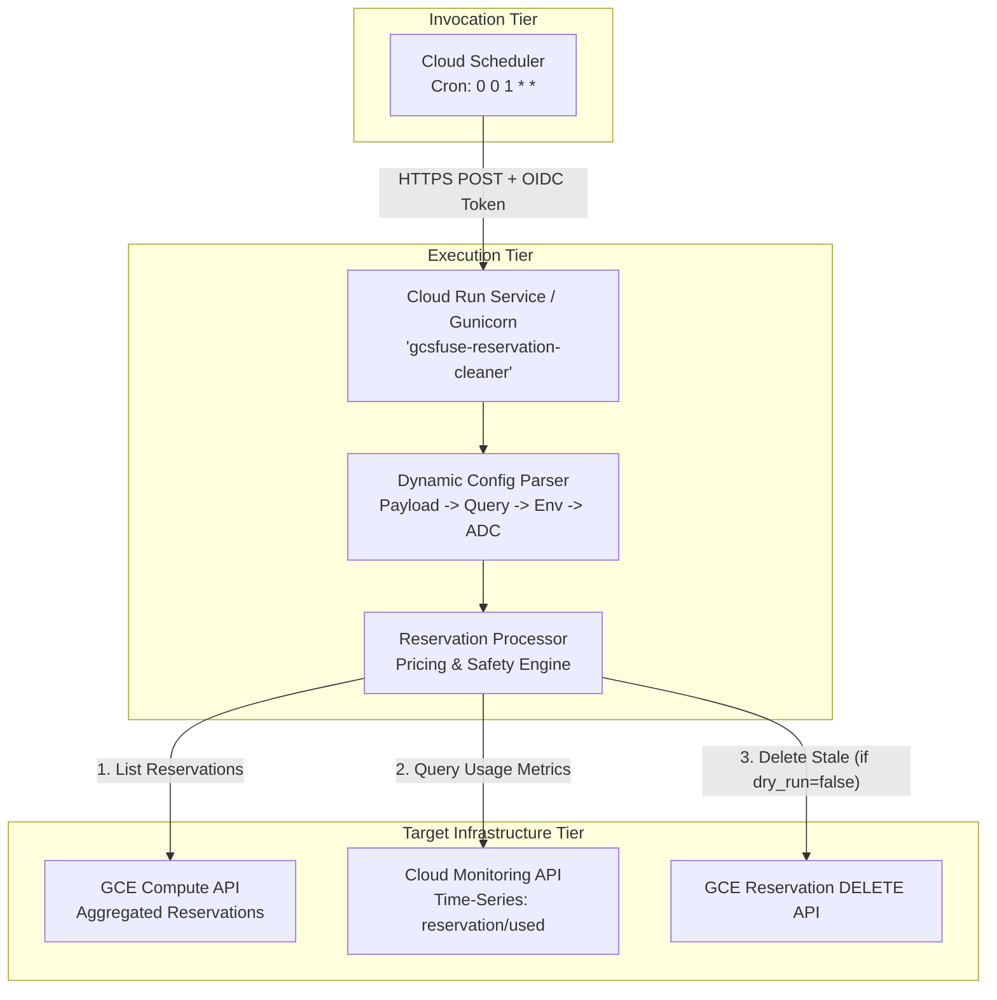

# GCE Compute Reservation Cleaner (`gcsfuse-reservation-cleaner`)

[](https://www.python.org/)
[](https://cloud.google.com/run)
[](./tests)

The **GCE Compute Reservation Cleaner** is an enterprise-grade Google Cloud automation service designed to discover, audit, and safely decommission stale, unused, or abandoned Google Compute Engine (GCE) compute reservations across all zones in target GCP projects. It calculates on-demand hourly, monthly, and annual financial cost savings, prevents resource hoarding, and provides dry-run simulation capabilities.

---

## 1. Overview & Problem Statement

GCE Compute Reservations allow organizations to guarantee instance capacity in specific zones for critical workloads or machine learning accelerators (e.g. GPUs, TPU-attached VMs, high-memory instances). However, reservations incur continuous billing charges at standard on-demand rates whether or not instances are currently attached. 

When development clusters, experimental workloads, or batch training jobs terminate, their associated reservations are frequently forgotten. The **Reservation Cleaner** solves this by:
1. Scanning all compute reservations across all zones in the target project.
2. Interrogating Cloud Monitoring time-series metrics (`compute.googleapis.com/reservation/used`) to establish lifetime and recent historical utilization.
3. Estimating financial costs based on regional machine type and accelerator pricing catalogs.
4. Safely deleting reservations that have been idle or never used beyond configurable thresholds while **strictly protecting active reservations** (`in_use_now > 0`).

---

## 2. Architecture & Invocation Flow

The service follows a decoupled three-tier serverless architecture:



### ASCII Invocation Flow

```
[ Cloud Scheduler ]
       | (Periodic Cron Trigger via HTTP POST + OIDC Token)
       v
[ Google Cloud Run Service (gcsfuse-reservation-cleaner) ]
       |
       +--> 1. cleaner/config.py: Resolve project, thresholds, and dry_run mode
       |
       +--> 2. cleaner/reservation_client.py: Aggregated list of reservations
       |
       +--> 3. cleaner/reservation_processor.py: Concurrently evaluate usage & pricing
       |       |
       |       +--> Check in_use_now > 0  ==> PROTECT (Active Now)
       |       +--> Query Cloud Monitoring metric ==> compute.googleapis.com/reservation/used
       |       +--> Calculate Hourly, Monthly ($/mo), Annual ($/yr) Cost
       |       +--> Identify Stale / Never Used Candidates
       |
       +--> 4. cleaner/reservation_client.py: Delete candidates (or log dry-run)
       |
       v
[ JSON Execution Summary & Audit Log Response (HTTP 200) ]
```

---

## 3. Directory Structure & File Inventory

```
cloud-run-services/gcsfuse-reservation-cleaner/
├── Dockerfile                      # Production container image definition (python:3.11-slim + gunicorn)
├── Procfile                        # Process manager definition for Cloud Run / App Engine
├── README.md                       # Comprehensive 9-section documentation
├── deploy.sh                       # Single-command automated deployment script
├── main.py                         # HTTP routing & Dual-entrypoint (Flask & Functions Framework)
├── requirements.txt                # Production and testing Python dependencies
├── cleaner/
│   ├── __init__.py                 # Package exports and module definitions
│   ├── config.py                   # Dynamic configuration resolution (Payload -> Query -> Env -> ADC)
│   ├── pricing.py                  # GCE machine type & GPU pricing catalog and cost models
│   ├── reservation_client.py       # REST/SDK client for GCE Compute and Cloud Monitoring APIs
│   ├── reservation_processor.py    # Stale evaluation logic, strict safety checks, and deletion lifecycle
│   └── service.py                  # Concurrent sweep coordinator and aggregate reporting
└── tests/
    ├── __init__.py
    └── test_reservation_cleaner.py # 100% offline mock test suite (36 tests)
```

---

## 4. Key Capabilities & Safety Controls

| Capability | Description | Safety Guarantee |
| :--- | :--- | :--- |
| **Strict Active Reservation Protection** | Inspects `specificReservation.inUseCount`. | If `in_use_now > 0`, the reservation is classified as `Active Now` and is **NEVER** marked as a candidate or deleted. |
| **Cloud Monitoring Metric Analysis** | Queries `compute.googleapis.com/reservation/used` over a lookback window (default 730 days). | Detects lifetime active hours and exact timestamp of last usage. |
| **Fail-Safe Error Handling** | Catches API timeouts, 5xx errors, and permissions failures per reservation. | Monitoring query failures classify the reservation as `Query Error` and retain it safely without crashing the fleet sweep. |
| **Financial Cost Modeling** | Comprehensive pricing catalog for N1, N2, N2D, E2, C2, C3, A2, A3, G2, T2D, and standalone GPUs. | Accurately calculates monthly and annual savings before taking action. |
| **First-Class Dry-Run Mode** | Configurable via payload, query args, or `DRY_RUN=true`. | Fully simulates the sweep, calculates financial metrics, and logs intended deletions without calling mutating APIs. |
| **Multi-Threaded Concurrency** | Configurable `ThreadPoolExecutor(max_workers=...)`. | Efficiently evaluates large multi-zone reservation fleets in parallel. |

---

## 5. IAM Security Model & Permissions Matrix

The service uses least-privilege separation of duties between the **Runner Service Account** (executes the cleanup inside Cloud Run) and the **Scheduler Service Account** (triggers the execution):

### Service Accounts & Roles

| Identity / Service Account | Granted IAM Role | Target Resource | Purpose / Justification |
| :--- | :--- | :--- | :--- |
| **Runner SA**<br/>`gcsfuse-res-cleaner-sa@${PROJECT_ID}.iam.gserviceaccount.com` | `roles/compute.admin` | GCP Project | Required to discover aggregated reservations and delete stale reservations. |
| **Runner SA**<br/>`gcsfuse-res-cleaner-sa@${PROJECT_ID}.iam.gserviceaccount.com` | `roles/monitoring.viewer` | GCP Project | Required to query time-series utilization metrics from Cloud Monitoring. |
| **Scheduler SA**<br/>`gcsfuse-res-cleaner-sched@${PROJECT_ID}.iam.gserviceaccount.com` | `roles/run.invoker` | Cloud Run Service | Required to generate authenticated OIDC tokens to trigger the service endpoint. |

---

## 6. Configuration Reference

The service dynamically resolves configuration parameters with the following precedence:
1. **HTTP JSON Request Body** (highest priority, used by Cloud Scheduler payloads).
2. **HTTP URL Query Parameters** (used for manual browser/curl invocations).
3. **Environment Variables** (container runtime defaults).
4. **Application Default Credentials (ADC)** / Internal defaults.

### Parameter Reference

| Parameter | JSON Payload Field | URL Query Param | Environment Variable | Type | Default | Description |
| :--- | :--- | :--- | :--- | :--- | :--- | :--- |
| **Target Project ID** | `project` / `project_id` | `project` / `project_id` | `PROJECT_ID` | `str` | *ADC Project* | Target GCP Project ID to sweep. |
| **Idle Threshold (Days)** | `delete_idle_days` | `delete_idle_days` | `DELETE_IDLE_DAYS` | `float` | `60.0` | Days of continuous non-use before an idle reservation is eligible for deletion. |
| **Delete Never Used** | `delete_never_used` | `delete_never_used` | `DELETE_NEVER_USED` | `bool` | `true` | Whether reservations with 0 lifetime active hours should be deleted. |
| **Max Age (Days)** | `max_age_days` | `max_age_days` | `MAX_AGE_DAYS` | `float` | `180.0` | Maximum reservation age threshold for never-used reservations. |
| **Monitoring Lookback** | `lookback_days` / `days` | `lookback_days` / `days` | `LOOKBACK_DAYS` | `int` | `730` | Number of past days to query in Cloud Monitoring time-series metrics. |
| **Dry Run Mode** | `dry_run` | `dry_run` | `DRY_RUN` | `bool` | `false` | When `true`, simulates actions without invoking destructive deletion APIs. |
| **Worker Threads** | `max_workers` | `max_workers` | `MAX_WORKERS` | `int` | `10` | Concurrency thread pool size for querying and processing. |
| **Zone Filter** | `zones` | `zones` | `ZONES` | `list[str]` | `null` (all) | Optional list of specific zones to filter (e.g. `["us-central1-a"]`). |
| **Reservation Filter** | `reservation_names` | `reservation_names` | `RESERVATION_NAMES` | `list[str]` | `null` (all) | Optional list of specific reservation names to evaluate. |
| **Exclude Label Keys** | `exclude_label_keys` | `exclude_label_keys` | `EXCLUDE_LABEL_KEYS` | `list[str]` | `["keep-alive", "do-not-delete", "protected", "permanent", "no-auto-delete", "skip-lifecycle"]` | Reservation label keys that exempt reservation from deletion. |
| **Whitelist Tags / Labels** | `whitelist_tags` | `whitelist_tags` | `WHITELIST_TAGS` | `list[str]` | `["keep-alive", "do-not-delete", "protected", "permanent", "no-auto-delete", "skip-lifecycle"]` | Tag/label names that exempt reservation from deletion. |

---

## 7. Single-Command Deployment

The included `deploy.sh` script automates end-to-end provisioning of the Cloud Run service and Cloud Scheduler job adhering to the repository standard.

### Prerequisites
- `gcloud` CLI installed and authenticated (`gcloud auth login`).
- Active Google Cloud project with billing enabled.

### Deployment Commands

```bash
# 1. Navigate to the tool directory
cd cloud-run-services/gcsfuse-reservation-cleaner

# 2. Deploy with default settings (Project resolved from active gcloud config)
./deploy.sh

# 3. Deploy to a specific project and region with custom monthly schedule
./deploy.sh \
  --project my-gcp-project \
  --region europe-west4 \
  --schedule "0 2 1 * *"

# 4. Deploy in Dry-Run mode for safe initial auditing
./deploy.sh \
  --project my-gcp-project \
  --dry-run
```

### CLI Flag Reference

```text
Usage: deploy.sh [OPTIONS]

Options:
  -p, --project PROJECT_ID          Target GCP Project ID (Required if not set via PROJECT_ID env var)
  -r, --region REGION               GCP Region for Cloud Run & Scheduler (Default: us-central1)
  -s, --schedule CRON_SCHEDULE      Cron schedule expression (Default: "0 0 1 * *")
  -a, --service-account EMAIL       Runtime Service Account email for Cloud Run
      --scheduler-sa EMAIL          Invocation Service Account email for Cloud Scheduler
  -d, --dry-run                     Configure default scheduler payload in dry-run mode (Default: false)
  -h, --help                        Show this help message and exit
```

---

## 8. Local Development & Offline Testing

The test suite runs 100% offline with zero live cloud dependencies by mocking REST and SDK interfaces.

### Setup Environment & Run Tests

```bash
# 1. Create and activate a virtual environment
python3 -m venv venv
source venv/bin/activate

# 2. Install dependencies
pip install -r requirements.txt

# 3. Run unit tests via pytest
pytest tests/ -v

# Or run via Python unittest
python3 -m unittest discover -s tests -v
```

### Test Coverage Highlights
- **Active Safety**: Confirms reservations with `in_use_now > 0` are never deleted.
- **Stale Detection**: Confirms reservations idle > 60 days trigger deletion.
- **Never Used Policy**: Confirms 0-usage reservations are deleted when enabled and retained when disabled.
- **Dry-Run Integrity**: Verifies zero deletion API calls occur in dry-run mode.
- **Pricing Model**: Validates monthly ($/mo) and annual ($/yr) formulas across diverse machine types and GPUs.
- **Deployment Syntax**: Automates static `bash -n` validation of `deploy.sh`.

---

## 9. Operations, Monitoring & Maintenance

### Manual Invocations

#### Triggering via `gcloud` (Authenticated)
```bash
# Trigger an immediate dry-run audit
gcloud run services proxy gcsfuse-reservation-cleaner \
  --project my-gcp-project \
  --region us-central1 \
  -- http://localhost:8080/ \
  -H "Content-Type: application/json" \
  -d '{"project": "my-gcp-project", "dry_run": true}'
```

#### Triggering Cloud Scheduler Manually
```bash
gcloud scheduler jobs run gcsfuse-reservation-cleaner-scheduler \
  --project my-gcp-project \
  --location us-central1
```

### Viewing Execution Logs & Savings Reports
```bash
# View Cloud Run live logs
gcloud logging read \
  'resource.type="cloud_run_revision" AND resource.labels.service_name="gcsfuse-reservation-cleaner"' \
  --project my-gcp-project \
  --limit 50 \
  --format="table(timestamp, textPayload, jsonPayload.message)"
```

### Example JSON Response
```json
{
  "status": "success",
  "service": "gcsfuse-reservation-cleaner",
  "project_id": "my-gcp-project",
  "dry_run": true,
  "summary": {
    "total_reservations": 8,
    "active_now": 4,
    "idle": 2,
    "never_used": 2,
    "recently_used": 0,
    "candidates_for_deletion": 4,
    "deleted": 0,
    "dry_run_candidates": 4,
    "errors": 0,
    "total_monthly_cost_usd": 4250.80,
    "candidate_monthly_savings_usd": 1845.20,
    "candidate_annual_savings_usd": 22142.40,
    "realized_monthly_savings_usd": 0.0,
    "realized_annual_savings_usd": 0.0
  },
  "actions_taken": [
    "[DRY-RUN] Simulated deletion for stale reservation 'gpu-dev-pool' in 'us-central1-a'. Estimated savings: $1250.00/month.",
    "[DRY-RUN] Simulated deletion for stale reservation 'test-n2-pool' in 'us-central1-b'. Estimated savings: $595.20/month."
  ],
  "reservations": [ ... ],
  "errors": []
}
```
