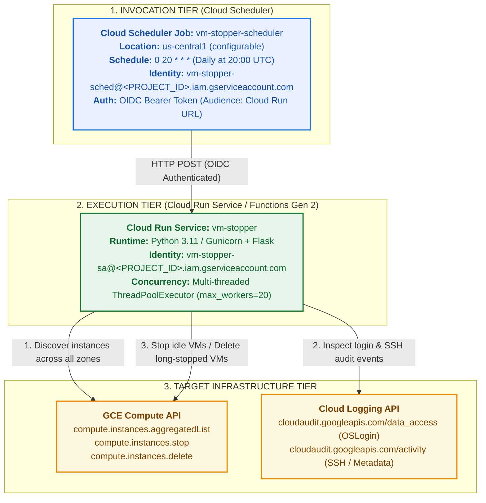

# GCE VM Stopper: Automated Cloud Run Idle VM Remediation Service

This service provides an automated, project-agnostic Cloud Run / Cloud Functions Gen 2 solution to scan Google Compute Engine (GCE) VM instances across all zones in target Google Cloud projects, detect idle running VMs (via Cloud Logging OSLogin audit events and instance metadata events), and stop them safely. It also provides optional lifecycle management to delete long-stopped VMs while strictly protecting GKE cluster nodes, Managed Instance Group (MIG) members, and whitelisted instances.

---

## 1. Overview & Architecture

Compute Engine VMs left running without active workloads incur continuous compute and licensing costs. The `vm-stopper` service provides scheduled sweeps across all compute zones in one or more GCP projects to remediate idle infrastructure.

The architecture comprises three decoupled tiers:
1. **Invocation Tier (Cloud Scheduler)**: Periodically triggers the Cloud Run service via HTTPS with secure Google-signed OIDC authentication tokens.
2. **Execution Tier (Cloud Run / Cloud Functions Gen 2)**: Containerized Python service executing multi-threaded sweeps, querying GCE aggregated instance lists and Cloud Logging audit entries.
3. **Target Infrastructure Tier (GCE & Cloud Logging)**: Stops confirmed idle running VMs and cleans up long-stopped VMs across any specified GCP project.



---

## 2. Directory Structure & File Inventory

All source code, container specifications, tests, and deployment scripts reside in `cloud-run-services/vm-stopper/`:

```text
cloud-run-services/vm-stopper/
├── Dockerfile                   # Production container definition (python:3.11-slim + Gunicorn)
├── Procfile                     # Process runner specification for App Engine / Cloud Run
├── README.md                    # 9-section architecture, IAM, deployment, and operations guide
├── deploy.sh                    # Single-command end-to-end deployment & scheduler setup script
├── main.py                      # HTTP routing, Flask app, and Functions Framework entrypoint
├── requirements.txt             # Production and testing Python dependencies
├── stopper/                     # Core Python modular package
│   ├── __init__.py              # Package exports
│   ├── config.py                # Hierarchical dynamic configuration resolution & validation
│   ├── gce_client.py            # GCE Compute and Cloud Logging API client wrappers
│   ├── service.py               # Request orchestration and HTTP response handling
│   └── vm_processor.py          # GKE/MIG filtering, whitelist rules, lifecycle evaluation, concurrency
└── tests/                       # 100% offline mock unit test suite
    ├── __init__.py
    └── test_vm_stopper.py       # Comprehensive unit tests for config, filters, lifecycle, and CLI
```

---

## 3. Key Capabilities & Safety Features

1. **Strict GKE & MIG Infrastructure Protection**:
   The service automatically detects and excludes all instances associated with Google Kubernetes Engine (GKE) clusters or Managed Instance Groups (MIGs) through name prefixes (`gke-`, `gk3-`), labels (`goog-k8s-*`, `goog-gke-*`), network tags, and instance metadata (`created-by`, `cluster-name`, `instance-template`).
2. **Multi-Signal Idle Activity Detection**:
   Evaluates Cloud Audit logs for OSLogin data access events, instance SSH key injection (`setMetadata`, `setInstanceAttributes`), and direct OSLogin activity.
3. **Fail-Safe Cloud Logging Fallback**:
   If Cloud Logging queries encounter permission errors, API timeouts, or network failures, the service assumes the VM is **active** to prevent accidental stopping of workloads.
4. **Recent Creation Grace Period**:
   Running instances created less than `idle_days_threshold` days ago (default: 7 days) are automatically exempted without checking logs.
5. **Comprehensive Whitelisting**:
   Exempts instances by exact name or substring matching (`whitelist_names`), label keys (`exclude_label_keys`), specific label key-value pairs (`exclude_label_values`), and network tags (`whitelist_tags`).
6. **Optional Long-Stopped VM Cleanup**:
   Optionally purges VMs that have been in `TERMINATED`, `STOPPED`, or `SUSPENDED` status for longer than `stopped_days_threshold` days (default: 90 days). Disabled by default (`delete_stopped_vms: false`).
7. **Simulated Dry-Run Execution**:
   Supports `dry_run: true` mode via JSON payload, query parameters, or environment variables to log all candidate actions without invoking any mutating stop or delete APIs.
8. **Per-VM Error Isolation**:
   Evaluates and mutates instances concurrently using `ThreadPoolExecutor`. If an error occurs on a single VM (e.g. quota limit or concurrent lock), other instances continue processing and errors are aggregated in the response JSON.

---

## 4. IAM Security Model & Permissions Matrix

The service uses two dedicated Service Accounts following the principle of least privilege:

| Identity | Recommended Email | IAM Roles Granted | Scope / Purpose |
| :--- | :--- | :--- | :--- |
| **Runner SA** | `vm-stopper-sa@<PROJECT_ID>.iam.gserviceaccount.com` | `roles/compute.instanceAdmin.v1`<br/>`roles/logging.viewer` | Runtime identity for Cloud Run. Authorizes aggregated instance discovery, instance stop/delete operations, and reading Cloud Audit / OSLogin logs. |
| **Scheduler SA** | `vm-stopper-sched@<PROJECT_ID>.iam.gserviceaccount.com` | `roles/run.invoker` | Invocation identity for Cloud Scheduler. Authorizes generating OIDC tokens to invoke the authenticated Cloud Run service. |

---

## 5. Configuration Reference

The service dynamically resolves configuration parameters with the following precedence:
1. **HTTP Request JSON Payload** (for Cloud Scheduler / programmatic invocations)
2. **HTTP URL Query Parameters** (for manual testing via browser/curl)
3. **Environment Variables** (container defaults)
4. **Application Default Credentials (ADC)** (for `project_id`)

| Parameter | JSON Payload Key | Query Param | Environment Variable | Type | Default | Description |
| :--- | :--- | :--- | :--- | :--- | :--- | :--- |
| **Project ID** | `project`, `project_id` | `project` | `PROJECT_ID`, `GOOGLE_CLOUD_PROJECT` | string | *ADC / Required* | Target Google Cloud Project ID |
| **Idle Threshold** | `idle_days_threshold` | `idle_days` | `IDLE_DAYS_THRESHOLD` | int | `7` | Days of no login/SSH activity before stopping running VMs |
| **Stopped Threshold**| `stopped_days_threshold`| `stopped_days` | `STOPPED_DAYS_THRESHOLD` | int | `90` | Days stopped before eligible for deletion |
| **Delete Stopped VMs**| `delete_stopped_vms` | `delete_stopped` | `DELETE_STOPPED_VMS` | bool | `false` | When true, deletes VMs stopped >= `stopped_days_threshold` |
| **Dry Run Mode** | `dry_run` | `dry_run` | `DRY_RUN` | bool | `false` | When true, identifies candidates without stopping/deleting |
| **Max Workers** | `max_workers` | `max_workers` | `MAX_WORKERS` | int | `20` | Thread pool size for parallel instance processing |
| **Exclude Label Keys**| `exclude_label_keys` | `exclude_label_keys` | `EXCLUDE_LABEL_KEYS` | list/str | `["keep-alive", "do-not-stop", "do-not-delete", "protected", "permanent", "no-auto-stop", "no-auto-delete", "whitelisted", "skip-lifecycle"]` | VM label keys that exempt instances |
| **Exclude Label Values**| `exclude_label_values`| - | `EXCLUDE_LABEL_VALUES` | dict/json | `{}` | Label key-value pairs that exempt instances (e.g. `auto-stop: false`) |
| **Whitelist Names** | `whitelist_names` | `whitelist_names` | `WHITELIST_NAMES` | list/str | `[]` | VM name substrings or exact names to exempt |
| **Whitelist Tags** | `whitelist_tags` | `whitelist_tags` | `WHITELIST_TAGS` | list/str | `["keep-alive", "do-not-stop", "do-not-delete", "protected", "permanent", "no-auto-stop", "no-auto-delete", "whitelisted", "skip-lifecycle"]` | Network tags that exempt instances |

---

## 6. Single-Command Deployment (`deploy.sh`)

The automated deployment script provisions all required Google Cloud resources, builds the container image using Cloud Build, deploys the Cloud Run service, and sets up the Cloud Scheduler trigger.

### Deployment Options
```bash
./deploy.sh [OPTIONS]

Options:
  -p, --project PROJECT_ID          Target GCP Project ID (Required if PROJECT_ID env var is not set)
  -r, --region REGION               GCP Region for Cloud Run & Scheduler (Default: us-central1)
  -s, --schedule CRON_SCHEDULE      Cron schedule expression (Default: "0 20 * * *")
  -a, --service-account EMAIL       Runtime Service Account email for Cloud Run
      --scheduler-sa EMAIL          Invocation Service Account email for Cloud Scheduler
  -d, --dry-run                     Configure default invocation payload in dry-run mode
  -h, --help                        Show this help message and exit
```

### Deployment Examples

```bash
# 1. Standard production deployment:
./deploy.sh --project my-gcp-project

# 2. Deploy in a specific region with a custom daily schedule:
./deploy.sh -p my-gcp-project -r europe-west1 -s "0 22 * * *"

# 3. Deploy in dry-run mode for initial evaluation:
./deploy.sh -p my-gcp-project --dry-run
```

---

## 7. Local Development & Offline Testing

### Prerequisites
- Python 3.11+
- Virtual environment with dependencies installed:
  ```bash
  pip install -r requirements.txt
  ```

### Running Offline Unit Tests
Run the comprehensive 100% offline test suite (mocking Compute and Logging APIs):
```bash
pytest tests/ -v
# Or using standard unittest:
python3 -m unittest discover -s tests -v
```

### Running Locally with Flask
```bash
export PROJECT_ID="my-gcp-project"
export DRY_RUN="true"
python main.py
```

### Testing with `curl`
```bash
# Trigger dry-run sweep via GET:
curl "http://localhost:8080/?project=my-gcp-project&dry_run=true"

# Trigger sweep with custom thresholds via POST:
curl -X POST http://localhost:8080/ \
  -H "Content-Type: application/json" \
  -d '{
    "project": "my-gcp-project",
    "idle_days_threshold": 14,
    "delete_stopped_vms": false,
    "dry_run": true
  }'
```

---

## 8. HTTP API Request & Response Schema

### Request Payload (JSON)
```json
{
  "project": "my-gcp-project",
  "idle_days_threshold": 7,
  "stopped_days_threshold": 90,
  "delete_stopped_vms": false,
  "dry_run": false,
  "exclude_label_keys": ["keep-alive", "permanent"],
  "whitelist_names": ["bastion-vm"]
}
```

### Response Payload (JSON)
```json
{
  "status": "success",
  "service": "vm-stopper",
  "project_id": "my-gcp-project",
  "dry_run": false,
  "summary": {
    "total_scanned": 12,
    "stopped": 2,
    "dry_run_stops": 0,
    "deleted": 0,
    "dry_run_deletions": 0,
    "skipped_gke_mig": 5,
    "skipped_whitelisted": 2,
    "skipped_active": 2,
    "skipped_recently_created": 1,
    "skipped_stopped": 0,
    "skipped_other": 0,
    "errors_count": 0
  },
  "actions_taken": [
    "Stopped idle running VM 'test-worker-1' in zone 'us-central1-a' (no login/activity in >= 7 days)",
    "Stopped idle running VM 'analytics-dev' in zone 'us-central1-b' (no login/activity in >= 7 days)"
  ],
  "errors": [],
  "details": [ ... ]
}
```

---

## 9. Operations & Maintenance

### Manually Triggering Execution via Cloud Scheduler
```bash
gcloud scheduler jobs run vm-stopper-scheduler \
  --project="my-gcp-project" \
  --location="us-central1"
```

### Viewing Real-Time Logs
```bash
# View Cloud Run service logs
gcloud logging read 'resource.type="cloud_run_revision" AND resource.labels.service_name="vm-stopper"' \
  --project="my-gcp-project" \
  --limit=50 \
  --format="value(textPayload)"

# View Cloud Scheduler execution logs
gcloud logging read 'resource.type="cloud_scheduler_job" AND resource.labels.job_id="vm-stopper-scheduler"' \
  --project="my-gcp-project" \
  --limit=20
```

### Pausing or Resuming the Scheduled Sweep
```bash
# Pause schedule
gcloud scheduler jobs pause vm-stopper-scheduler --project="my-gcp-project" --location="us-central1"

# Resume schedule
gcloud scheduler jobs resume vm-stopper-scheduler --project="my-gcp-project" --location="us-central1"
```
