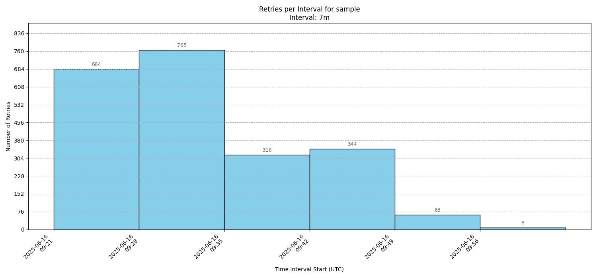

GCSFuse Stalled Read Retry Analysis Toolkit
============================================

This directory contains a set of scripts designed to fetch and analyze Google Cloud Storage FUSE (GCSFuse) logs from Google Cloud Logging. The tools help in identifying and visualizing the frequency and distribution of retries caused by stalled read requests.

The workflow is flexible: use `fetch_logs.sh` to download logs from Google Cloud Logging to a location of your choice. Then, use the Python analysis scripts (`retries_per_interval.py` and `requests_per_retry_count.py`) to process the downloaded log file by providing its path.


Scripts Overview
----------------

1. `fetch_logs.sh`: A bash script that queries Google Cloud Logging for "stalled read-req" log entries from pods matching a given regex. It saves these logs to a specified output path or to a default location in `/tmp/` if no path is provided.
2. `retries_per_interval.py`: A Python script that takes a path to a CSV log file as input and aggregates the "stalled read-req" retry counts into user-defined time intervals. It generates a new CSV file and a bar chart visualization of the results.
3. `requests_per_retry_count.py`: A Python script that processes a given CSV log file to analyze "stalled read-req" retries. It identifies unique requests by their UUID and provides a summary table showing how many requests were retried a specific number of times.


Prerequisites
-------------

Before you begin, ensure you have the following installed and configured:

* Google Cloud SDK (`gcloud`): Required by `fetch_logs.sh` to query logs from Google Cloud Logging. You must be authenticated (`gcloud auth login`) and have the necessary permissions.
  - Installation Guide (https://cloud.google.com/sdk/docs/install)

* Python 3: Required to run the analysis scripts.

* Python Libraries: The analysis scripts depend on `pandas` and `matplotlib`. You can install them using the provided requirements.txt file:

    `pip install -r requirements.txt`

Usage Workflow
--------------

The intended workflow is a two-step process:

**Step 1: Fetch Logs**

First, use the `fetch_logs.sh` script to download the GCSFuse logs for a specific set of pods using a regular expression.

**Note:** Before running, make sure the script is executable: `chmod +x fetch_logs.sh`

Syntax:

    ./fetch_logs.sh <cluster_name> <pod_name_regex> <start_time> <end_time> [output_file_path]

Examples:

- Fetch logs to a default path:

        ./fetch_logs.sh xpk-large-scale-usc1f-a sample "2025-02-04T18:00:00+05:30" "2025-02-05T10:00:00+05:30"
    This will save the logs to the file named `/tmp/sample-logs.csv`.

- Fetch logs to a custom path:

        ./fetch_logs.sh xpk-large-scale-usc1f-a "sample-job-.*" "2025-02-04T18:00:00+05:30" "2025-02-05T10:00:00+05:30" "/var/log/gcsfuse/my_analysis.csv"
    This will save the logs to the file named `/var/log/gcsfuse/my_analysis.csv`.

**Step 2: Analyze the logs**

Once you have the log file, you can use the Python scripts to analyze it.

- **Analyze and Visualize Retries Over Time**

    Use `retries_per_interval.py` to see how the frequency of retries changes over time. Provide the path to the log file created in Step 1.

    Syntax:

        python retries_per_interval.py <log_file_path> [--interval <interval>]

    Example:

        python retries_per_interval.py /tmp/sample-job-logs.csv --interval 5m

    Output:

    - `<output_prefix>-retries.csv`: A CSV file in your current directory with the following format:
        ```
        Interval Start (UTC),Retries
        2025-05-14 16:31:00,4
        2025-05-14 16:32:00,14
        2025-05-14 16:33:00,12
        2025-05-14 16:34:00,2299
        2025-05-14 16:35:00,606
        ```
    - `<output_prefix>-retries.png`: A bar chart visualizing the retries over the specified intervals, saved in your current directory which looks like this:
    

- **Analyze Unique Requests per Retry Count**

    Use `requests_per_retry_count.py` to determine how many unique requests were retried a specific number of times. Provide the path to the log file from Step 1.

    Syntax:

        python requests_per_retry_count.py <log_file_path>

    Example:

        python requests_per_retry_count.py /tmp/sample-logs.csv

    Output:

    - A summary table printed to the console:

        ```
        Processing file: /tmp/sample-logs.csv
        Retries    | Requests
        -----------+----------
        1          | 248
        2          | 32
        3          | 10
        ```
