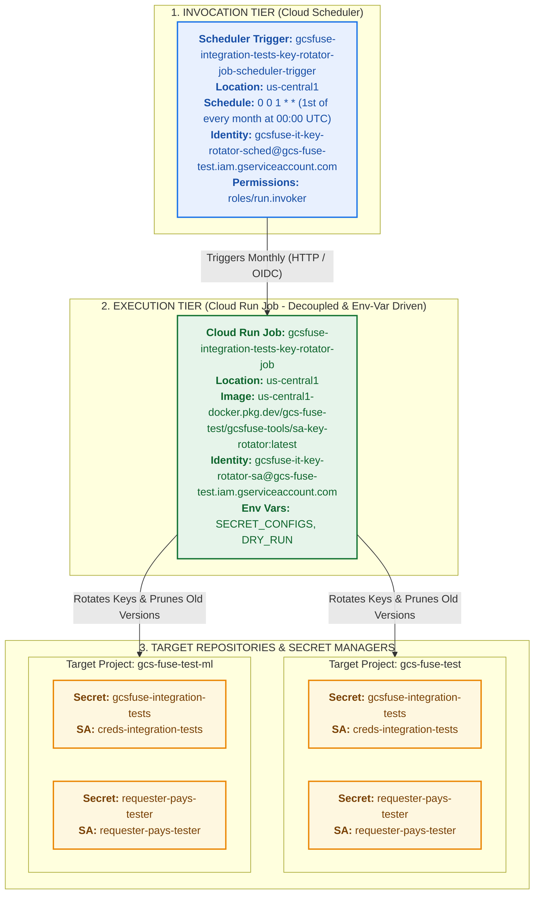

# GCSFuse Integration Tests: Automated Service Account Key Rotation Playbook

This playbook documents the architecture, IAM security permissions, automated scheduling infrastructure, and operational procedures for maintaining, testing, and deploying the automated Service Account key rotation system for GCSFuse integration tests from the `gcsfuse-tools` repository (Source of Truth).

---

## 1. Overview & Architecture

Integration tests in GCSFuse validate credentials, mounts, read-only permissions, and requester-pays bucket access using Google Cloud Secret Manager secrets containing IAM Service Account private keys. 

Because GCP IAM service account keys enforce a strict 90-day expiration lifetime, an automated Cloud Run Job and Cloud Scheduler trigger rotate all configured keys on the **1st of every month** in-memory, upload them directly to Secret Manager as the latest versions, destroy all older Secret Manager versions, and prune all older/expired keys from IAM to prevent hitting quota limits.



---

## 2. Directory Structure & Source of Truth (SOT)

All source code, container build definitions, and deployment configurations are versioned in `gcsfuse-tools/sa-key-rotator` as the canonical Source of Truth:

```text
sa-key-rotator/
├── Dockerfile              # Container image specification based on google/cloud-sdk:alpine
├── rotate_sa_keys.sh       # Core key rotation and Secret Manager synchronization logic
├── deploy.sh               # Single-command end-to-end deployment script for Cloud Run & Scheduler
├── README.md               # Playbook documentation and operational guide
└── key_rotation_playbook.md
```

---

## 3. Key Capabilities & Safety Features

1. **Single-Command Automated Deployment:**
   The `deploy.sh` script automates prerequisite checks, API enablement, Service Account & IAM configuration, Artifact Registry creation, Cloud Build container compilation, Cloud Run Job provisioning, and Cloud Scheduler trigger setup.
2. **Decoupled Configuration via Environment Variables:**
   Target secrets, service accounts, and projects are configured directly via the `SECRET_CONFIGS` environment variable on the Cloud Run Job. No container rebuilds are required when adding or modifying targets.
3. **Safety-First Default (DRY RUN):**
   The rotation script defaults to `DRY_RUN` mode unless `DRY_RUN="false"` is explicitly passed.
4. **Strict Upfront Validation:**
   The script parses and validates every target tuple upfront before initiating any API calls. If any tuple is malformed, it immediately errors out with a helpful message.
5. **Per-Target Isolation & Error Resilience:**
   An unexpected error on a single secret/project does not abort the entire job; the script continues processing the remaining targets, logs detailed failure info, and exits with code `1` at the end so monitoring alerts fire.
6. **Automatic Secret Creation:**
   If a configured Secret does not already exist in Secret Manager, the rotator automatically creates it with `--replication-policy=automatic` before uploading the initial key version.
7. **Complete Older Version Destruction & IAM Pruning:**
   Destroys all older Secret Manager versions (keeping exclusively the latest active version) and deletes older IAM service account keys to prevent version sprawl and quota exhaustion.
8. **Isolated Sectioned Logging:**
   Execution output begins with 10 blank lines to isolate consecutive Cloud Run job invocation logs, and each rotation target is framed in its own dedicated, indexed log section.

---

## 4. Infrastructure & Resource Inventory

All hosting resources reside in project **`gcs-fuse-test`** in region **`us-central1`**:

| Component | Resource Name / ID | Project / Location | Purpose |
| :--- | :--- | :--- | :--- |
| **Cloud Run Job** | `gcsfuse-integration-tests-key-rotator-job` | `gcs-fuse-test` / `us-central1` | Executes containerized key rotation task |
| **Cloud Scheduler** | `gcsfuse-integration-tests-key-rotator-job-scheduler-trigger` | `gcs-fuse-test` / `us-central1` | Triggers the job on the 1st of every month (`0 0 1 * *`) |
| **Artifact Registry** | `gcsfuse-tools` | `gcs-fuse-test` / `us-central1` | Docker repository storing `sa-key-rotator` images |
| **Runner SA** | `gcsfuse-it-key-rotator-sa@gcs-fuse-test...` | `gcs-fuse-test` | Runtime identity with permissions to manage keys and secrets |
| **Scheduler SA** | `gcsfuse-it-key-rotator-sched@gcs-fuse-test...` | `gcs-fuse-test` | Trigger identity authorized to invoke Cloud Run Job |

---

## 5. IAM Security Model & Permissions

### 5.1 Permissions Matrix

| Target Resource | Granted Identity | Role | Justification |
| :--- | :--- | :--- | :--- |
| `creds-integration-tests` SA (`gcs-fuse-test` & `gcs-fuse-test-ml`) | `gcsfuse-it-key-rotator-sa` | `roles/iam.serviceAccountKeyAdmin` | Creates new keys and deletes old keys for this SA |
| `requester-pays-tester` SA (`gcs-fuse-test` & `gcs-fuse-test-ml`) | `gcsfuse-it-key-rotator-sa` | `roles/iam.serviceAccountKeyAdmin` | Creates new keys and deletes old keys for this SA |
| `gcsfuse-integration-tests` Secret (`gcs-fuse-test` & `gcs-fuse-test-ml`) | `gcsfuse-it-key-rotator-sa` | `roles/secretmanager.admin` | Adds new secret versions, destroys old versions, and reads payloads |
| `requester-pays-tester` Secret (`gcs-fuse-test` & `gcs-fuse-test-ml`) | `gcsfuse-it-key-rotator-sa` | `roles/secretmanager.admin` | Adds new secret versions, destroys old versions, and reads payloads |
| `gcsfuse-integration-tests-key-rotator-job` Cloud Run Job | `gcsfuse-it-key-rotator-sched` | `roles/run.invoker` | Authorizes Cloud Scheduler to invoke the job via OIDC |

### 5.2 Onboarding a New Target Project / Secret

When adding a new secret or service account in an existing or new GCP project:

```bash
RUNNER_SA="gcsfuse-it-key-rotator-sa@gcs-fuse-test.iam.gserviceaccount.com"

# 1. Grant KeyAdmin on the new target SA
gcloud iam service-accounts add-iam-policy-binding "NEW_SA@NEW_PROJECT.iam.gserviceaccount.com" \
  --project="NEW_PROJECT" \
  --member="serviceAccount:${RUNNER_SA}" \
  --role="roles/iam.serviceAccountKeyAdmin"

# 2. Grant project-level Secret Manager permission (required for secret creation and management)
gcloud projects add-iam-policy-binding "NEW_PROJECT" \
  --member="serviceAccount:${RUNNER_SA}" \
  --role="roles/secretmanager.admin"
```

---

## 6. Single-Command Deployment (`deploy.sh`)

To deploy or update the complete infrastructure (Cloud Build image, Cloud Run Job, and Cloud Scheduler trigger) directly from the repository source:

```bash
cd sa-key-rotator
./deploy.sh
```

### What `deploy.sh` Does:
1. Verifies prerequisites and active GCP authentication.
2. Enables required Google Cloud APIs (`run`, `cloudscheduler`, `cloudbuild`, `artifactregistry`, `secretmanager`, `iam`).
3. Creates/verifies Service Accounts (`gcsfuse-it-key-rotator-sa` and `gcsfuse-it-key-rotator-sched`) and configures `roles/run.invoker`.
4. Creates/verifies the Artifact Registry Docker repository (`gcsfuse-tools`).
5. Builds and pushes the container image to Artifact Registry using Cloud Build.
6. Deploys/updates the Cloud Run Job with default target environment variables.
7. Deploys/updates the Cloud Scheduler trigger to run monthly at `0 0 1 * *`.

### Customizing Deployment via Environment Variables:
```bash
PROJECT_ID="gcs-fuse-test" \
REGION="us-central1" \
SECRET_CONFIGS="gcsfuse-integration-tests|creds-integration-tests|gcs-fuse-test" \
DRY_RUN="false" \
./deploy.sh
```

---

## 7. Local Development & Testing

Since the repository is the Source of Truth, you can test modifications locally before deploying:

```bash
# 1. Run local test in DRY_RUN mode
export SECRET_CONFIGS="gcsfuse-integration-tests|creds-integration-tests|gcs-fuse-test"
export DRY_RUN="true"
./rotate_sa_keys.sh
```

```bash
# 2. Re-deploy changes to Cloud Run in a single command
./deploy.sh
```

---

## 8. Updating Targets Without Code Changes

Because configuration is decoupled via environment variables, you can update targets directly on Cloud Run without redeploying code:

```bash
gcloud run jobs update gcsfuse-integration-tests-key-rotator-job \
  --region=us-central1 \
  --project=gcs-fuse-test \
  --update-env-vars="^#^SECRET_CONFIGS=gcsfuse-integration-tests|creds-integration-tests|gcs-fuse-test,gcsfuse-integration-tests|creds-integration-tests|gcs-fuse-test-ml,requester-pays-tester|requester-pays-tester|gcs-fuse-test,requester-pays-tester|requester-pays-tester|gcs-fuse-test-ml,NEW_SECRET|NEW_SA|NEW_PROJECT#DRY_RUN=false"
```

---

## 9. Operations & Maintenance

### 9.1 Running a Dry Run on Cloud Run
To verify the job without modifying any keys:
```bash
gcloud run jobs execute gcsfuse-integration-tests-key-rotator-job \
  --update-env-vars="DRY_RUN=true" \
  --region=us-central1 \
  --project=gcs-fuse-test \
  --wait
```

### 9.2 Triggering a Manual Live Rotation
To force immediate live rotation across all configured targets:
```bash
gcloud run jobs execute gcsfuse-integration-tests-key-rotator-job \
  --update-env-vars="DRY_RUN=false" \
  --region=us-central1 \
  --project=gcs-fuse-test \
  --wait
```

### 9.3 Pausing or Changing the Rotation Schedule

* **Pause Scheduler:**
  ```bash
  gcloud scheduler jobs pause gcsfuse-integration-tests-key-rotator-job-scheduler-trigger \
    --location=us-central1 \
    --project=gcs-fuse-test
  ```
* **Resume Scheduler:**
  ```bash
  gcloud scheduler jobs resume gcsfuse-integration-tests-key-rotator-job-scheduler-trigger \
    --location=us-central1 \
    --project=gcs-fuse-test
  ```
* **Change Schedule:**
  ```bash
  gcloud scheduler jobs update http gcsfuse-integration-tests-key-rotator-job-scheduler-trigger \
    --location=us-central1 \
    --project=gcs-fuse-test \
    --schedule="0 0 1 * *"
  ```
